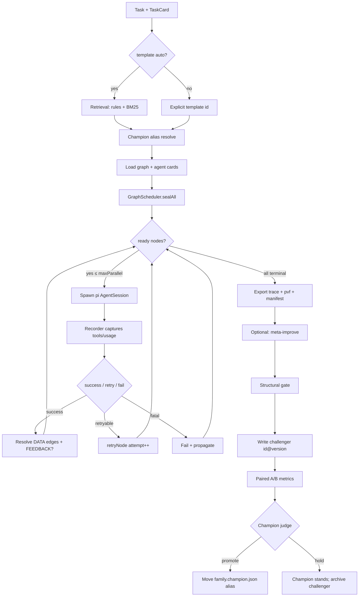
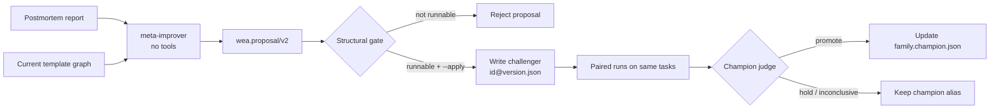

# WorkflowEvolveAgent (WEA)

A **self-evolving, observable, multi-agent coding workflow runtime** built on the
**pi SDK** (`@earendil-works/pi-coding-agent`), in pure TypeScript.

WEA turns a one-shot coding agent call into a **versioned workflow graph** you can
schedule, trace, attribute, retrieve, cache, redesign, and promote — only when a
challenger **wins a paired comparison** against the current champion.

### Model split (important)

| Plane | Env / config | Role |
|-------|----------------|------|
| **WEA control** | `WEA_BASE_URL` / `WEA_API_KEY` / `WEA_MODEL` | Plan: retrieve best graph → **adapt** or **cold-start** → (later) meta-improve |
| **pi workers** | `~/.pi/agent` default provider/model | Every graph node (`inspect` / `implement` / `verify` / …) |

Default live path for `--template auto`:

```
task + full template catalog
     → WEA control LLM (cloud) classifies task & chooses:
         use | adapt | cold_start
     → structural gate
     → schedule graph
     → each node = pi AgentSession on **default pi model**
```

Offline BM25 retrieval is **only** a fallback when `WEA_*` is missing, sim mode,
or `--offline-plan` — it is **not** the live router.

### Master loops (control plane)

1. **Escalation replan** — any worker may emit `"escalate": true` in its JSON.
   WEA freezes the graph, packs task + all node attempts + reason, asks the
   control model for a **new graph**, then re-runs (bounded, default max 2).
2. **Post-run improve** — after the task ends, the control model reviews the
   *process* (not just the code) and may write a versioned challenger template
   under `library/templates/<id>@<ver>.json`.
3. **Proactive master handoff** — a graph node with `controlHandoff: true`
   (card `master-handoff`) is an intentional takeover point. Example template
   `t-explore-master-implement`:
   ```
   explore_a / explore_b  (cheap pi workers)
        → wea_master        (WEA strong model: plan + invent edit graph)
        → implement→verify  (pi workers, with ${master_plan} injected)
   ```
   Workers may still *reactively* escalate; handoff is the *planned* use of the
   strong model mid-graph.

> **Runtime:** pi SDK · Node ≥ 20 · TypeScript  
> **Control endpoint:** any Anthropic-messages-compatible API (`WEA_*`)  
> **Worker model:** interactive pi defaults (e.g. `kuaipao/grok-4.5`)  
> **中文说明:** [README.zh-CN.md](./README.zh-CN.md)  
> **Install:** [`./install.sh`](./install.sh)

---

## Table of contents

1. [Feature map (complete)](#1-feature-map-complete)
2. [What WEA is / is not](#2-what-wea-is--is-not)
3. [Architecture](#3-architecture)
4. [End-to-end lifecycle](#4-end-to-end-lifecycle)
5. [Workflow graphs](#5-workflow-graphs)
6. [Graph algorithms](#6-graph-algorithms)
7. [Self-evolution pipeline](#7-self-evolution-pipeline)
8. [Retrieval (Phase 3)](#8-retrieval-phase-3)
9. [Exact reuse cache (Phase 4)](#9-exact-reuse-cache-phase-4)
10. [Champion gate (Phase 5)](#10-champion-gate-phase-5)
11. [Mathematics reference](#11-mathematics-reference)
12. [Observability & IR](#12-observability--ir)
13. [MCP-over-bash bridge](#13-mcp-over-bash-bridge)
14. [Trust model (D28)](#14-trust-model-d28)
15. [Token economics](#15-token-economics)
16. [Repository layout](#16-repository-layout)
17. [Quick start](#17-quick-start)
18. [Proven vs pending](#18-proven-vs-pending)
19. [Design record](#19-design-record)

---

## 1. Feature map (complete)

### 1.1 Execution (L1 / L2)

| Feature | What it does |
|---------|----------------|
| **Workflow templates as graphs** | Nodes + DATA/CONTROL/FEEDBACK edges + bounded loops |
| **Event-driven scheduler** | SEAL → readiness → parallel spawn → success/fail propagation |
| **Triggers** | `ALL_SUCCESS`, `ANY_SUCCESS` |
| **Bounded FEEDBACK loops** | Explicit fix loops with `maxIterations` (runtime unfolding) |
| **Bounded node retry** | Retryable failures re-arm without resolving outbound edges |
| **Dependency-failure propagation** | Impossible triggers fail downstream nodes |
| **Per-node pi AgentSession** | Isolated short sessions; JSON output contract |
| **Per-node tool allowlists** | Role cards limit `read/grep/find/ls/edit/write/bash` |
| **Per-node model override** | Optional model id on a node |
| **Run-level hard budget** | Wall clock / tokens / $ → abort |
| **Path normalization + redaction** | Sensitive paths redacted at capture time |
| **Self-computed digests** | Tool results hashed (pi does not provide digests) |
| **CLI runner** | `run.ts` over shared orchestrator |
| **Web GUI** | Live DAG + per-agent activity via SSE (`npm run gui`) |
| **Simulate mode** | Real scheduler + stub nodes; offline demo, no API |

### 1.2 Selection & reuse (L3)

| Feature | What it does |
|---------|----------------|
| **TaskCard retrieval** | Rule router + BM25 over template shape text |
| **Safe fallback** | No signal → `t1-safe-generic` |
| **Champion alias resolution** | Family pick + version pin via `*.champion.json` |
| **Content-addressed exact cache** | Fail-closed pure/read-only reuse with certificates |
| **Repo snapshot binding** | Cache key includes git HEAD + dirty digest |

### 1.3 Self-evolution (L4)

| Feature | What it does |
|---------|----------------|
| **Meta-improver agent** | Trusted redesign from postmortem + current graph |
| **Open edit vocabulary** | Add/remove nodes/edges/loops, edit prompts, set models |
| **Structural gate only** | Executability checks — not a safety veto |
| **Immutable releases** | Challengers written as `id@version.json`; base never mutated |
| **Champion gate** | Promote only on quality non-inferiority + efficiency gain + no material regression |
| **Alias promotion / hold** | Move pointer on win; never delete losing releases |

### 1.4 Observability

| Feature | What it does |
|---------|----------------|
| **`wea.trace/v1`** | Compliance / replay surface |
| **`wea.pvf.trace/v1`** | Attribution (PVF) projection |
| **Manifest** | Full internal record; offline rebuild of both traces |
| **Scheduler event log** | SEAL / READY / RUNNING / SUCCESS / FAIL / RETRY / LOOP_* |
| **Read/write sets + observations** | Dependency vocabulary for audit |

### 1.5 MCP bridge (optional module)

| Feature | What it does |
|---------|----------------|
| **One bash tool surface** | Model reaches MCP via `wea-mcp` only |
| **Session-lived resident bridge** | Hot connections for the whole node session |
| **Progressive disclosure** | `search` / `describe` before full schemas |
| **Large results stay on disk** | `--out FILE` then `rg` / `jq` |
| **Structured MCP observations** | Auditable `mcp_call` records |
| **Read-only MCP exact cache** | Fail-closed session cache for annotated RO tools |

### 1.6 Product surfaces

| Surface | Role |
|---------|------|
| **CLI** | Batch / CI / scripted runs |
| **Web GUI** | Human-in-the-loop visualization |
| **pi SDK embed** | Node execution engine (not interactive pi TUI plugin) |
| **`install.sh`** | One-shot deps + offline tests |

---

## 2. What WEA is / is not

| Is | Is not |
|----|--------|
| A **workflow runtime** that embeds the **pi SDK** | An interactive `pi` TUI extension you `pi install` and chat with |
| One **graph node** = one headless `createAgentSession` | Sharing context with your current pi chat session |
| Templates as **versioned, measurable assets** | Prompt-only multi-agent glue |
| Safety via **measurement (champion)** | Safety via forbidding redesign ideas |

```
Interactive pi (human TUI)     ≠     WEA (orchestrator)
        │                                    │
        │                                    ├── createAgentSession (node A)
        │                                    ├── createAgentSession (node B)
        └── one long chat session            └── createAgentSession (node C)
```

---

## 3. Architecture

### 3.1 Layering

```
┌─────────────────────────────────────────────────────────────┐
│  Surfaces:  CLI (run.ts)  ·  Web GUI (gui-server)  ·  tests │
└────────────────────────────┬────────────────────────────────┘
                             │
┌────────────────────────────▼────────────────────────────────┐
│  L4 Evolution   meta-improve · template-edit · champion     │
├─────────────────────────────────────────────────────────────┤
│  L3 Select/Reuse   retrieval · exact cache · champion alias │
├─────────────────────────────────────────────────────────────┤
│  L2 Execute   orchestrator · GraphScheduler · node-session  │
├─────────────────────────────────────────────────────────────┤
│  L1 Capture   recorder-ext · budget · trace-export          │
└────────────────────────────┬────────────────────────────────┘
                             │ pi SDK
┌────────────────────────────▼────────────────────────────────┐
│  AgentSession + tools: read · grep · find · ls · edit ·     │
│  write · bash   (+ optional MCP via wea-mcp)                │
└─────────────────────────────────────────────────────────────┘
```

### 3.2 Control vs data plane

```
Control plane (WEA)                 Data plane (per node)
───────────────────                 ────────────────────
pick template                       system prompt (agent card)
schedule nodes                      tool allowlist
budgets / retry / loops             model call(s)
emit IR                             repo tools / bash / MCP
evolve templates                    JSON output contract
```

---

## 4. End-to-end lifecycle



**ASCII (same pipeline):**

```
task
  → retrieve family (+ champion version)
  → schedule graph (parallel nodes, loops, retries)
  → each node = short pi session + JSON out
  → write IR (trace / pvf / manifest)
  → [optional] meta redesign → structural gate → challenger
  → [optional] paired compare → promote alias or hold
```

---

## 5. Workflow graphs

### 5.1 Schema (conceptual)

A **template** is:

\[
T = (id, version, summary, G),\quad
G = (V, E, L)
\]

- \(V\): nodes  
- \(E\): edges  
- \(L\): bounded loops  

**Node** \(v \in V\):

| Field | Meaning |
|-------|---------|
| `id` | Unique node name |
| `kind` | `planner` \| `worker` \| `verifier` \| `aggregator` |
| `agentCard` | Role card in `library/agents/*.md` |
| `trigger` | `ALL_SUCCESS` \| `ANY_SUCCESS` |
| `promptTemplate` | String with `${task}`, `${upstream}` |
| `model?` | Optional per-node model override |
| `budget?` | Optional per-node ceilings |

**Edge** \(e \in E\):

| Field | Meaning |
|-------|---------|
| `id` | Unique edge id |
| `from` / `to` | Node id, or `@input` / `@output` |
| `kind` | `DATA` \| `CONTROL` \| `FEEDBACK` |
| `loopId?` | Required iff `kind = FEEDBACK` |

**Loop** \(\ell \in L\):

| Field | Meaning |
|-------|---------|
| `id` | Loop name |
| `bodyNodes` | Nodes re-armed each iteration |
| `feedbackEdges` | FEEDBACK edge ids that close the loop |
| `maxIterations` | Hard cap \(\ge 1\) |

### 5.2 Edge semantics

| Kind | Counts for readiness? | Role |
|------|----------------------|------|
| `DATA` | Yes | Artifact / success dependency |
| `CONTROL` | Yes | Control dependency without data payload |
| `FEEDBACK` | **No** | Bounded re-entry only |

Ports:

- `@input` — task entry (not a real node)  
- `@output` — successful exit frontier  

### 5.3 Cold-start library

#### T0 — direct

```
@input → inspect → implement → verify → @output
```

#### T1 — safe generic (+ fix loop)

```
@input → inspect → implement ⇄ verify → @output
                      ▲ FEEDBACK (max 2)
```

#### T2 — bugfix

```
@input → localize → patch ⇄ regression → @output
                     ▲ FEEDBACK fix (max 2)
```

#### T3 — complex (fan-out / fan-in)

```
@input → explore_a ──┐
       → explore_b ──┴→ aggregate → implement ⇄ verify → @output
```

### 5.4 Agent cards (roles)

| Card | Typical tools | Duty |
|------|---------------|------|
| `inspector` | read-only | Recon + plan JSON |
| `explorer` | read-only | Independent approach branch |
| `aggregator` | read-only | Merge parallel proposals |
| `implementer` | read + edit/write/bash | Apply change |
| `verifier` | read + bash | Independent verdict JSON |
| `meta-improver` | **no tools** | Redesign template only |

Every node’s final assistant message must parse as a **JSON object** (contract).
Parse failure = node failure (bounded retry may apply).

---

## 6. Graph algorithms

Implementation: `runner/src/graph.ts`, structural checks in `template-edit.ts`.

### 6.1 Executable subgraph

Define the **executable edge set** (ignores FEEDBACK and pure ports for cycle checks):

\[
E_{\mathrm{exec}} = \{ e \in E \mid e.\mathrm{kind} \ne \mathrm{FEEDBACK},\ e.\mathrm{from} \notin \{\texttt{@input}\},\ e.\mathrm{to} \notin \{\texttt{@output}\} \}
\]

**Invariant:** \((V, E_{\mathrm{exec}})\) must be a **DAG**. FEEDBACK is the only
allowed cyclic mechanism, and only inside a declared loop.

### 6.2 Acyclicity (Kahn / topological count)

```
indegree[v] ← |{ u → v in E_exec }|
ready ← { v | indegree[v] = 0 }
visited ← 0
while ready nonempty:
  v ← pop(ready); visited++
  for each v → w in E_exec:
    indegree[w]--; if 0 then push w
accept iff visited = |V|
```

If `visited < |V|`, there is a cycle outside FEEDBACK → template rejected / scheduler throws.

### 6.3 Reachability: `@input` ⇝ `@output`

BFS/DFS on all non-FEEDBACK edges including ports:

\[
\mathrm{Reach}(\texttt{@input}) \ni \texttt{@output}
\]

Otherwise the structural gate reports: `@output is not reachable from @input`.

### 6.4 Node state machine

```
DECLARED
   │ sealAll()
   ▼
WAITING_DEPS ──satisfied──► READY ──spawn──► RUNNING
     ▲                         │                │
     │                    impossible            ├─success──► SUCCEEDED
     │                         │                ├─retry────► WAITING_DEPS (attempt++)
     │                         ▼                └─fail─────► FAILED
     │                      FAILED                    │
     └──────── loop re-arm (body) ◄───────────────────┘
                                                  CANCELLED / SKIPPED (terminal set)
```

Terminal set:

\[
\mathcal{T} = \{\mathrm{SUCCEEDED},\mathrm{FAILED},\mathrm{CANCELLED},\mathrm{SKIPPED}\}
\]

### 6.5 SEAL

Before any spawn, `sealAll()`:

1. Marks every node `sealed = true`  
2. Moves non-terminal nodes to `WAITING_DEPS`  
3. Evaluates readiness once  

After seal, the incoming edge set for readiness is fixed for the run
(FEEDBACK re-arms attempts; it does not invent new topology mid-run).

### 6.6 Readiness triggers

Let \(P(v)\) be **required parents** of \(v\): incoming edges with
`kind ∈ {DATA, CONTROL}` and `from ≠ @input` (FEEDBACK excluded).

For each parent edge \(e\), status \(\sigma(e) \in \{\mathrm{PENDING},\mathrm{SUCCESS},\mathrm{DONE\_UNSUCCESSFUL}\}\).

\[
s = |\{e \in P(v):\sigma(e)=\mathrm{SUCCESS}\}|,\quad
d = |\{e \in P(v):\sigma(e)\ne\mathrm{PENDING}\}|,\quad
n = |P(v)|
\]

**ALL_SUCCESS**

\[
\mathrm{satisfied} \iff s = n,\qquad
\mathrm{impossible} \iff d > s
\]

(i.e. any unsuccessful completion makes ALL_SUCCESS impossible.)

**ANY_SUCCESS**

\[
\mathrm{satisfied} \iff (n=0) \lor (s \ge 1),\qquad
\mathrm{impossible} \iff (d = n) \land (s = 0)
\]

If `impossible` → node `FAILED` with `DEPENDENCY_FAILED` and outbound edges
resolve as `DONE_UNSUCCESSFUL` (propagation).

### 6.7 Success / failure resolution

On **success** of node \(u\):

- For each outbound non-FEEDBACK edge \(u \to v\): \(\sigma \leftarrow \mathrm{SUCCESS}\), refresh \(v\)  
- Then run FEEDBACK handler (below)

On **failure** of \(u\):

- Outbound non-FEEDBACK edges: \(\sigma \leftarrow \mathrm{DONE\_UNSUCCESSFUL}\)  
- Downstream triggers may become impossible

### 6.8 Bounded FEEDBACK loops (runtime unfolding)

FEEDBACK edges **do not** affect readiness. When source \(u\) succeeds:

```
for each FEEDBACK edge u → w with loopId = ℓ:
  if not loopRetry(u, output): continue          # e.g. verdict pass
  if ℓ.iteration >= ℓ.maxIterations:
    emit LOOP_EXHAUSTED; continue
  ℓ.iteration += 1
  emit LOOP_ITERATION
  for each body node b in ℓ.bodyNodes:
    re-arm b: state ← WAITING_DEPS; attempt++
    reset outbound non-FEEDBACK edges of b to PENDING
  # inbound edges from outside the body stay SUCCESS (artifacts still valid)
  refresh readiness of all body nodes
```

**Default loop predicate** (`defaultLoopRetry`):

\[
\mathrm{retry}(out) \iff
out.\mathrm{verdict}\in\{\texttt{fail},\texttt{retry}\}
\ \lor\ out.\mathrm{retry}=\mathrm{true}
\]

### 6.9 Node-level retry (not a loop)

For retryable session errors (e.g. JSON contract violation), `retryNode`:

- Does **not** resolve outbound edges  
- `attemptNo += 1`, state → `WAITING_DEPS` → often immediately `READY`  
- CLI default: **at most one** such retry per node per run  

### 6.10 Parallel event loop (orchestrator)

```
sealAll()
while not allTerminal():
  for n in readyNodes() while |inFlight| < maxParallel:
    markRunning(n); spawn runNode(n)
  if inFlight empty and stalled(): break
  wait any finish
  success → reportSuccess
  retryable → retryNode
  else → reportFailure
export traces
```

**Stalled:** nothing READY/RUNNING but not all terminal (wedged graph).

### 6.11 Structural gate (evolution-time, not runtime)

Before writing a challenger, `gateProposal` applies edits then checks:

1. No duplicate node/edge ids  
2. Every edge endpoint exists (or is `@input`/`@output`)  
3. FEEDBACK edges name a loop  
4. Loops reference live nodes/edges; `maxIterations ≥ 1`  
5. `@input` reaches `@output` on non-FEEDBACK graph  
6. Acyclic outside FEEDBACK  
7. No orphan: every node has ≥1 non-FEEDBACK incoming edge  
8. Proposal non-empty and targets the right template id  

**Empty violation list ⇒ runnable, not “good”.** Goodness = champion gate.

### 6.12 Template edit algebra

Proposal schema `wea.proposal/v2` applies an ordered list of ops:

| Op | Effect |
|----|--------|
| `remove_node` | Drop node; strip incident edges; prune empty loops |
| `add_node` | Insert node with kind/card/trigger/prompt |
| `edit_prompt` | Replace `promptTemplate` |
| `set_model` | Set per-node model |
| `add_edge` / `remove_edge` | Rewire |
| `set_loop` / `remove_loop` | Declare or drop bounded loops |

Applied purely in TS (no LLM) by `applyEditsToGraph` / `applyProposal`.
New file: `library/templates/<id>@<newVersion>.json`.

---

## 7. Self-evolution pipeline

### 7.1 Flow



### 7.2 Why this shape (D28)

| Stage | Question answered |
|-------|-------------------|
| Meta-agent | “What redesign might be better?” (unrestricted ideas) |
| Structural gate | “Can this graph execute?” |
| Champion gate | “Did it win on real measurements?” |

Power comes from **winning the measurement**, not from being permitted.

### 7.3 CLI (semi-automatic today)

```bash
# 1) produce a postmortem JSON (from traces / human / tooling)
# 2) propose (+ optional apply)
WEA_BASE_URL=... WEA_API_KEY=... WEA_MODEL=... \
  npx tsx src/meta-improve.ts \
    --report postmortem.json \
    --template t3-complex \
    --apply

# 3) run champion vs challenger on paired tasks; feed metrics to champion.judge
```

Full auto `run → improve → promote` is **not** welded as a single default loop yet.

---

## 8. Retrieval (Phase 3)

### 8.1 Inputs

\[
\mathrm{TaskCard} = (\mathrm{goal},\ \mathrm{family}?,\ \mathrm{language}?,\ \mathrm{hasOracle}?)
\]

Catalog = **base** templates only (`*.json` without `@version` in the filename).

### 8.2 Document text for each template

Concatenate id, summary, and **shape tags** derived from the graph:

| Shape signal | Tags added |
|--------------|------------|
| ≥2 planners | `parallel`, `explore`, `fanout` |
| has aggregator | `aggregate`, `merge`, `fanin` |
| has verifier | `verify`, `test`, `review` |
| has loops | `loop`, `retry`, `fix` |
| ≤3 nodes | `simple`, `small`, `direct` |

### 8.3 Hybrid score

\[
\mathrm{score}(T) =
\mathrm{BM25}(q, d_T)
+ \mathbf{1}[T=\mathrm{route}(\mathrm{family})]\cdot B
+ \mathbf{1}[\mathrm{hasOracle} \land T\ \mathrm{has\ verifier}]\cdot 0.5
\]

with rule bonus \(B = 10\) (dominates BM25 so family routing wins ties).

Family route:

| family | template |
|--------|----------|
| `direct` | `t0-direct` |
| `generic` | `t1-safe-generic` |
| `bugfix` | `t2-bugfix` |
| `complex` | `t3-complex` |

If top score is \(0\): force tiny score on `t1-safe-generic` (never return empty).

### 8.4 After retrieval

\[
\mathrm{runRef} = \mathrm{currentChampion}(\mathrm{familyOf}(T^\star))
\]

Default alias target = base id when no `family.champion.json` exists.

---

## 9. Exact reuse cache (Phase 4)

### 9.1 Eligibility (fail-closed)

A finished node is cacheable iff **all** hold:

- `usedBash = false` (bash has invisible read-set)  
- `writeSet = ∅`  
- no `edit` / `write` tool calls  
- `status = success` and parsed `output` present  

Otherwise: **never store / never hit**.

### 9.2 Key

\[
K = H\!\left(\texttt{wea.cache/v1},\ H(\mathrm{sysPrompt}),\ \mathrm{taskPrompt},\ \mathrm{modelId},\ H_{\mathrm{repo}}\right)
\]

where \(H\) is SHA-256 style digest (`digestOf`), and \(H_{\mathrm{repo}}\) is
git HEAD + dirty snapshot digest.

### 9.3 Certificate

A hit returns stored output **and** a `ReuseCertificate` binding every key part
for audit. Lookup re-checks bound facts against the request (defense in depth).

> Wiring note: module is proven offline; hooking into every spawn path is listed
> under pending integration.

---

## 10. Champion gate (Phase 5)

### 10.1 Arm metrics

For template ref \(r\) over \(N\) paired runs:

\[
\mathrm{Arm}(r) = (\mathrm{tokens}_i,\ \mathrm{dollars}_i,\ \mathrm{pass}_i)_{i=1}^{N}
\]

Medians:

\[
\tilde{t}(r) = \mathrm{median}(\mathrm{tokens}),\quad
\tilde{c}(r) = \mathrm{median}(\mathrm{dollars})
\]

Pass counts: \(P(r) = \sum_i \mathbf{1}[\mathrm{pass}_i]\).

### 10.2 Gains

\[
g_t = \frac{\tilde{t}(\mathrm{champ}) - \tilde{t}(\mathrm{chal})}{\tilde{t}(\mathrm{champ})},\quad
g_c = \frac{\tilde{c}(\mathrm{champ}) - \tilde{c}(\mathrm{chal})}{\tilde{c}(\mathrm{champ})}
\]

(Positive ⇒ challenger cheaper on that axis.)

Constants:

\[
\gamma_{\min} = 0.05,\qquad \rho_{\max} = 0.10
\]

### 10.3 Decision rule

Promote challenger **iff all** hold:

1. **Quality non-inferiority:** \(P(\mathrm{chal}) \ge P(\mathrm{champ})\)  
2. **No material regression:**  
   \[
   \max(-g_t,\ -g_c) \le \rho_{\max}
   \]  
   (neither axis worse than 10%)  
3. **Real efficiency gain:**  
   \[
   \max(g_t,\ g_c) \ge \gamma_{\min}
   \]  

Otherwise: champion stands.  
If (2) fails: verdict is **inconclusive** (run more pairs), not a win.  
Promotion only rewrites `library/templates/<family>.champion.json` → `{ "id": "<ref>" }`.

---

## 11. Mathematics reference

### 11.1 BM25 (retrieval)

For query terms \(Q\), document \(D\) with length \(|D|\), average length
\(\mathrm{avgdl}\), collection size \(N\), document frequency \(n_t\):

\[
\mathrm{IDF}(t) = \ln\!\left(1 + \frac{N - n_t + 0.5}{n_t + 0.5}\right)
\]

\[
\mathrm{BM25}(Q,D) = \sum_{t \in Q}
\mathrm{IDF}(t)\cdot
\frac{f(t,D)\,(k_1+1)}{f(t,D) + k_1\left(1-b+b\frac{|D|}{\mathrm{avgdl}}\right)}
\]

WEA defaults: \(k_1 = 1.5\), \(b = 0.75\).

### 11.2 Hybrid retrieval score

\[
\mathrm{score}(T\mid \mathrm{card}) =
\mathrm{BM25}(q,d_T)
+ B\cdot\mathbf{1}_{\mathrm{route}}
+ 0.5\cdot\mathbf{1}_{\mathrm{oracle\text{-}verifier}}
\]

\[
B=10,\quad
q = \mathrm{goal}\,\|\,\mathrm{family}\,\|\,\mathrm{language}
\]

### 11.3 Trigger predicates

With \(s,d,n\) as in §6.6:

\[
\begin{aligned}
\mathrm{ALL\_SUCCESS}&: &&\mathrm{ok}\Leftrightarrow s=n,&
&&\mathrm{imp}\Leftrightarrow d>s\\
\mathrm{ANY\_SUCCESS}&: &&\mathrm{ok}\Leftrightarrow n=0\lor s\ge 1,&
&&\mathrm{imp}\Leftrightarrow d=n\land s=0
\end{aligned}
\]

### 11.4 Loop bound

For loop \(\ell\) with counter \(i_\ell\) (starts at 1):

\[
i_\ell \leftarrow i_\ell + 1 \quad\text{only if}\quad
\mathrm{retry}(out)\ \land\ i_\ell < \ell.\mathrm{maxIterations}
\]

### 11.5 Cache key hash

\[
K = H(\texttt{wea.cache/v1}\,\|\,H(\mathrm{sys})\,\|\,\mathrm{task}\,\|\,\mathrm{model}\,\|\,H_{\mathrm{repo}})
\]

Eligibility indicator:

\[
\mathrm{Elig} =
\mathbf{1}[\neg\mathrm{bash}]
\cdot\mathbf{1}[\mathrm{writes}=\emptyset]
\cdot\mathbf{1}[\neg\mathrm{edit/write\ tools}]
\cdot\mathbf{1}[\mathrm{success}]
\]

### 11.6 Champion inequalities

\[
\boxed{
\begin{aligned}
&P_c \ge P_h \\
&\max(-g_t,-g_c) \le 0.10 \\
&\max(g_t,g_c) \ge 0.05
\end{aligned}
\Rightarrow \mathrm{promote}}
\]

### 11.7 Budget ledger (run-level)

Track cumulative tokens / monetary microunits / wall time. After each usage
sample, if any ceiling exceeded → `abort()` session (`BUDGET_EXCEEDED`).

Microunits: \(1\ \mathrm{USD} = 10^6\) microunits (integer accounting).

### 11.8 DAG topological necessity

Ignoring FEEDBACK, a valid template satisfies existence of a topological order
\(\pi: V \rightarrow \{1..|V|\}\) with

\[
\forall (u\to v)\in E_{\mathrm{exec}}:\ \pi(u) < \pi(v)
\]

equivalent to Kahn visit count \(|V|\).

---

## 12. Observability & IR

Each run writes three artifacts (same orchestrator for CLI and GUI):

| File | Schema / role |
|------|----------------|
| `*.manifest.json` | Full internal record (graph, node records, scheduler events) |
| `*.trace.json` | `wea.trace/v1` compliance surface |
| `*.pvf.json` | `wea.pvf.trace/v1` attribution input |

```bash
npx tsx src/rebuild.ts runs/<manifest>.json   # rebuild both surfaces offline
npm run smoke                                 # synthetic dual export
```

**Recorder** (`recorder-ext.ts`) is a pi InlineExtension: observe-only hooks on
`tool_call` / tool results / `message_end` usage; never mutates tool behavior.

---

## 13. MCP-over-bash bridge

```
model (bash only)
  └─ wea-mcp call server.tool --json '{...}' --out /tmp/r.json
        │  thin CLI → unix socket $WEA_MCP_SOCKET
        ▼
  resident McpBridge (session-lived hot MCP connections)
        ▼
  /tmp/r.json  →  rg / jq  →  small slice into context
```

| Mechanism | Benefit |
|-----------|---------|
| Progressive disclosure | Don’t preload all tool schemas |
| `--out` | Large payloads skip the model twice |
| RO annotations | Session exact-cache eligible |
| Destructive / unknown | Never cached (fail-closed) |

See [`mcp-bridge/README.md`](./mcp-bridge/README.md).  
Runner wiring of the extension into every node session is still **pending**.

---

## 14. Trust model (D28)

```
┌──────────────────────────────────────────┐
│ meta-agent may redesign anything         │
│ (delete verifier, rewire, swap models…)  │
└──────────────────┬───────────────────────┘
                   │
                   ▼
┌──────────────────────────────────────────┐
│ structural gate: does it *run*?          │
└──────────────────┬───────────────────────┘
                   │
                   ▼
┌──────────────────────────────────────────┐
│ champion gate: does it *win* on metrics? │
│ lose ⇒ old champion untouched            │
└──────────────────────────────────────────┘
```

Physical guardrail: trial runs should avoid irreversible external side effects
(sandbox property) — not a ban on AI judgment.

---

## 15. Token economics

Multi-node is **not** automatically cheaper than one long pi chat.

| Source of savings | Source of cost |
|-------------------|----------------|
| Short sessions + JSON handoff | Fixed orchestration / JSON tax |
| Tool allowlists reduce thrash | Oversized templates (e.g. always t3) |
| Exact cache on pure nodes | Cold cache, bash-heavy nodes |
| MCP `--out` filtering | Every node re-exploring the repo |
| Evolution deleting redundant nodes | Failed challenger experiments |

Rough intuition:

\[
\Delta\mathrm{tokens}
\approx
\Delta_{\mathrm{less\ history}}
+ \Delta_{\mathrm{less\ thrash}}
+ \Delta_{\mathrm{cache}}
+ \Delta_{\mathrm{MCP}}
+ \Delta_{\mathrm{evolved\ thinner\ graph}}
- \Delta_{\mathrm{multi\text{-}node\ tax}}
\]

Use **t0/t1** for simple work; reserve **t3** for true fan-out tasks.

---

## 16. Repository layout

```
WorkflowEvolveAgent/
├── install.sh              # one-shot install + offline tests
├── .env.example            # WEA_BASE_URL / WEA_API_KEY / WEA_MODEL
├── README.md               # this file
├── README.zh-CN.md         # Chinese guide
├── library/
│   ├── agents/             # role cards (frontmatter + system prompt)
│   └── templates/          # t0–t3 + optional id@version challengers
├── runner/                 # @wea/runner
│   ├── gui/                # web UI static assets
│   └── src/                # scheduler, orchestrator, evolution, IR, …
└── mcp-bridge/             # @wea/mcp-bridge
```

Deep dives: [`runner/README.md`](./runner/README.md), [`mcp-bridge/README.md`](./mcp-bridge/README.md).

---

## 17. Quick start

### One-shot install

```bash
git clone https://github.com/VonEquinox/WorkflowEvolveAgent.git
cd WorkflowEvolveAgent
chmod +x install.sh
./install.sh                 # deps + offline self-tests
# ./install.sh --gui         # then open http://127.0.0.1:7788
# ./install.sh --skip-test
```

### Offline

```bash
cd runner
npm test          # retrieval / cache / champion
npm run smoke     # synthetic traces
npm run gui       # Simulate mode in the browser
```

### Live run

```bash
cp .env.example .env   # edit WEA_*
set -a && source .env && set +a
cd runner
npx tsx src/run.ts \
  --task "node test.js fails: fix the off-by-one" \
  --template auto \
  --repo /path/to/target-repo \
  --out runs
```

### MCP bridge tests

```bash
cd mcp-bridge && npm test && bash scripts/e2e.sh
```

---

## 18. Proven vs pending

**Proven (live)**  
- T2 fixes a real bug end-to-end; T3 adds a real feature  
- Meta-agent proposed removing a redundant explorer; gate produced a runnable challenger  

**Proven (offline)**  
- Retrieval routing; fail-closed exact cache; champion promote/reject/inconclusive  
- MCP bridge against a real filesystem server (hot reuse, RO cache, fail-closed)  
- GUI Simulate drives the real scheduler  

**Pending (wiring)**  
- Multi-pair live A/B on a stable endpoint  
- Exact cache hooked into every spawn path  
- MCP bridge extension wired into runner node sessions  
- Worktree write-isolation; stronger per-node budget enforcement  
- Fully automatic `run → improve → promote` loop  

---

## 19. Design record

Key decisions are logged as **D-numbers** in the (local) design history.

**D28 (load-bearing):** safety moved from restricting proposals to **measuring
results** — trust the AI’s redesign space, gate only executability, let the
champion comparison decide what becomes default.

Other recurring themes in code comments: D7/D8 (one node attempt = one session),
D10 (bash volatile ⇒ uncacheable), D14 (bounded retry / output contract),
D19 (system prompt from card), D20 (WEA owns persistence), D21 (JSON contract),
D22 (self digests), D23 (path normalize + redaction).

---

## License / links

- GitHub: [VonEquinox/WorkflowEvolveAgent](https://github.com/VonEquinox/WorkflowEvolveAgent)  
- pi coding agent: [@earendil-works/pi-coding-agent](https://www.npmjs.com/package/@earendil-works/pi-coding-agent)
