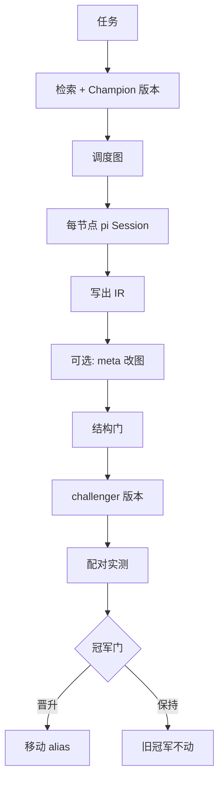
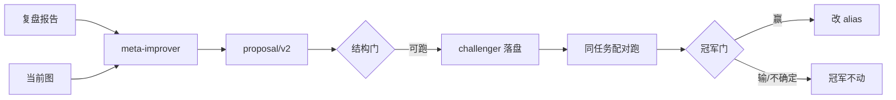

# WorkflowEvolveAgent（WEA）中文文档

一个**可观测、可复用、可自演化**的多智能体 coding 工作流运行时，基于 **pi SDK**（`@earendil-works/pi-coding-agent`），纯 TypeScript 实现。

WEA 把「一次 coding agent 调用」变成一张**可版本化的工作流图**：可调度、可 trace、可归因、可检索、可缓存、可改设计，并且**只有在配对实测中打赢当前冠军**时才会晋升为默认流程。

### 双模型拆分（关键）

| 平面 | 配置 | 职责 |
|------|------|------|
| **WEA 控制面** | `WEA_BASE_URL` / `WEA_API_KEY` / `WEA_MODEL` | 选图、改图（adapt）、冷启动新图、meta 进化 |
| **pi 工作面** | `~/.pi/agent` 默认 provider/model | 图上每个节点（inspect / implement / verify …） |

默认 live（`--template auto`）流程：

```
任务 + 完整模板目录
     → WEA 控制模型（云端 API）自己分类任务并决定：
         use | adapt | cold_start
     → 结构门
     → 调度图
     → 每个节点 = pi AgentSession（**用户默认 pi 模型**）
```

离线 BM25 **只**在没有 `WEA_*`、sim 模式或 `--offline-plan` 时兜底，**不是** live 路由。

### 主 Agent 双回路（控制面）

1. **异常升级 / 重规划** — 图上任意 worker 可在 JSON 里写 `"escalate": true`。
   WEA 冻结当前图，汇总任务 + 全部节点尝试 + 原因，交给控制模型 **重画一张图** 再跑（默认最多 2 次）。
2. **跑完后流程优化** — 任务结束后，控制模型审查 *过程*（不只是代码），
   可写出版本化 challenger：`library/templates/<id>@<ver>.json`。

> **运行时：** pi SDK · Node ≥ 20 · TypeScript  
> **控制端点：** Anthropic Messages 兼容 API（`WEA_*`）  
> **工作模型：** 交互式 pi 默认（例如 `kuaipao/grok-4.5`）  
> **English:** [README.md](./README.md)  
> **安装：** [`./install.sh`](./install.sh)

---

## 目录

1. [完整特性清单](#1-完整特性清单)
2. [是什么 / 不是什么](#2-是什么--不是什么)
3. [架构分层](#3-架构分层)
4. [端到端生命周期](#4-端到端生命周期)
5. [工作流图](#5-工作流图)
6. [图上的操作与算法](#6-图上的操作与算法)
7. [Workflow Self-Evolve 技术流程](#7-workflow-self-evolve-技术流程)
8. [检索 · 缓存 · 冠军门](#8-检索--缓存--冠军门)
9. [数学公式速查](#9-数学公式速查)
10. [可观测性 / MCP / 信任模型](#10-可观测性--mcp--信任模型)
11. [Token 账本直觉](#11-token-账本直觉)
12. [快速开始](#12-快速开始)
13. [已验证 vs 待接线](#13-已验证-vs-待接线)

更细的英文专章（BM25 展开、Kahn 伪代码、champion 不等式框等）见 [README.md](./README.md) §6–§11。

---

## 1. 完整特性清单

### 1.1 执行层（L1 / L2）

| 特性 | 说明 |
|------|------|
| **模板即图** | nodes + DATA/CONTROL/FEEDBACK + 有界 loops |
| **事件驱动调度** | SEAL → 就绪 → 并行 spawn → 成功/失败传播 |
| **触发器** | `ALL_SUCCESS` / `ANY_SUCCESS` |
| **有界 FEEDBACK 环** | 显式修复环，`maxIterations` 运行时展开 |
| **节点级有界重试** | 可重试失败不解析出边，直接 re-arm |
| **依赖失败传播** | trigger 不可能 → 下游 FAILED |
| **每节点独立 pi Session** | 短生命周期 + JSON 输出契约 |
| **角色工具白名单** | 按 agent card 裁剪 read/edit/bash… |
| **节点模型覆盖** | 可选 per-node model |
| **Run 级硬预算** | 墙钟 / token / 金额 → abort |
| **路径规范化 + 脱敏** | 敏感路径捕获时 redaction |
| **自算 content digest** | pi 不提供 digest，WEA 自哈希 |
| **CLI** | `run.ts` |
| **Web GUI** | SSE 实时 DAG + 每 agent 活动 |
| **Simulate** | 真调度器 + 桩节点，零 API |

### 1.2 选择与复用（L3）

| 特性 | 说明 |
|------|------|
| **TaskCard 检索** | 规则路由 + BM25（图形状标签） |
| **安全回退** | 无信号 → `t1-safe-generic` |
| **Champion 别名** | family 选型 + `*.champion.json` 定版本 |
| **内容寻址精确缓存** | 只读/纯节点，fail-closed + 证书 |
| **Repo snapshot 绑定** | key 含 git HEAD + dirty |

### 1.3 自演化（L4）

| 特性 | 说明 |
|------|------|
| **meta-improver** | 可信改图（无工具，纯推理） |
| **开放 edit 词汇表** | 增删节点/边/环、改 prompt、换模型 |
| **结构门** | 只问「能不能跑」 |
| **不可变发布** | `id@version.json`，母版不原地改 |
| **冠军门** | 质量不劣 + 效率增益 + 无严重回退才晋升 |
| **别名晋升** | 只动 pointer，从不删失败版本 |

### 1.4 可观测 / MCP / 产品面

- 双 IR：`wea.trace/v1` + `wea.pvf.trace/v1` + manifest  
- 调度事件日志、读写集、依赖观测  
- MCP-over-bash：热连接、渐进披露、`--out` 落盘、RO 缓存  
- 表面：CLI · GUI · 嵌入 pi SDK · `install.sh`  

---

## 2. 是什么 / 不是什么

| 是 | 不是 |
|----|------|
| 嵌入 **pi SDK** 的 workflow **运行时** | 交互式 `pi` TUI 插件（不能 `pi install` 后 `/wea`） |
| 图节点 = 无界面 `createAgentSession` | 与当前 pi 聊天会话共享上下文 |
| 模板是**可测量的版本化资产** | 纯 prompt 拼起来的 multi-agent |
| 安全靠**实测晋升** | 靠禁止 meta 改图想法 |

```
交互式 pi（人在 TUI 聊天）  ≠  WEA（编排器主机）
                                    ├─ AgentSession 节点 A
                                    ├─ AgentSession 节点 B
                                    └─ AgentSession 节点 C
```

---

## 3. 架构分层

```
表面层     CLI / Web GUI / 测试
   │
L4 演化    meta-improve · template-edit · champion
L3 选择    retrieval · exact cache · champion alias
L2 执行    orchestrator · GraphScheduler · node-session
L1 捕获    recorder-ext · budget · trace-export
   │
pi SDK     AgentSession + read/grep/find/ls/edit/write/bash
           （可选 wea-mcp → MCP）
```

**控制面（WEA）：** 选模板、调度、预算、IR、进化  
**数据面（节点）：** 角色 prompt、工具、模型调用、JSON 产出  

---

## 4. 端到端生命周期

```
任务 TaskCard
  → retrieval 选 family（规则 + BM25）
  → champion 别名定版本
  → 加载 graph + agent cards
  → sealAll → 事件循环：
        ready 节点（≤ maxParallel）→ pi session
        成功 / 重试 / 失败传播 / FEEDBACK 回环
  → 导出 trace + pvf + manifest
  → [可选] meta 改图 → 结构门 → challenger
  → [可选] 配对 A/B → 冠军门 → 晋升或保持
```



---

## 5. 工作流图

### 5.1 形式化

\[
T=(id,version,summary,G),\quad G=(V,E,L)
\]

- \(V\)：节点  
- \(E\)：边（DATA / CONTROL / FEEDBACK）  
- \(L\)：有界回环  

**节点字段：** `id, kind, agentCard, trigger, promptTemplate, model?, budget?`  
**边字段：** `id, from, to, kind, loopId?`（FEEDBACK 必须带 loopId）  
**环字段：** `id, bodyNodes, feedbackEdges, maxIterations≥1`  

特殊端口：`@input`（入口）、`@output`（出口）。

### 5.2 边语义

| kind | 是否计入就绪 | 作用 |
|------|--------------|------|
| DATA | 是 | 数据/成功依赖 |
| CONTROL | 是 | 控制依赖 |
| FEEDBACK | **否** | 仅用于有界回环 |

### 5.3 冷启动模板

| 模板 | 结构 | 场景 |
|------|------|------|
| **t0-direct** | inspect→implement→verify | 最简单 |
| **t1-safe-generic** | 同上 + fix 环 | 通用默认 |
| **t2-bugfix** | localize→patch⇄regression | 修 bug |
| **t3-complex** | explore×2→aggregate→implement⇄verify | 复杂并行 |

```
T2:
  @input → localize → patch ⇄ regression → @output
                       ▲ FEEDBACK max=2

T3:
  @input → explore_a ──┐
         → explore_b ──┴→ aggregate → implement ⇄ verify → @output
```

### 5.4 角色卡

| 角色 | 工具 | 职责 |
|------|------|------|
| inspector / explorer | 只读 | 勘察 / 独立方案 |
| aggregator | 只读 | 合并并行方案 |
| implementer | 读写+bash | 改代码 |
| verifier | 读+bash | 独立裁决 |
| meta-improver | **无工具** | 只改模板图 |

节点最终消息必须是 **JSON 对象**；解析失败 = 节点失败。

---

## 6. 图上的操作与算法

实现：`runner/src/graph.ts`、结构检查：`template-edit.ts`。

### 6.1 可执行子图与无环

\[
E_{\mathrm{exec}}=\{e\in E\mid e.\mathrm{kind}\ne\mathrm{FEEDBACK},\ \text{端点非纯端口}\}
\]

**不变量：** \((V,E_{\mathrm{exec}})\) 必须是 **DAG**。环只能通过声明的 FEEDBACK loop 存在。

**Kahn 计数检验：**

```
indegree / 拓扑弹出
visited == |V|  ⇒ 无环
visited <  |V|  ⇒ 存在未声明环 → 拒绝
```

### 6.2 可达性

在非 FEEDBACK 边上从 `@input` BFS/DFS，必须到达 `@output`。

### 6.3 状态机

```
DECLARED →(seal)→ WAITING_DEPS → READY → RUNNING
                      ↑                ├─ SUCCEEDED
                      │                ├─ retry → WAITING_DEPS (attempt++)
                 loop re-arm           └─ FAILED → 出边 DONE_UNSUCCESSFUL
```

终态集：\(\mathcal{T}=\{\mathrm{SUCCEEDED},\mathrm{FAILED},\mathrm{CANCELLED},\mathrm{SKIPPED}\}\)。

### 6.4 SEAL

`sealAll()`：固定就绪相关入边语义，全部进入 `WAITING_DEPS` 并刷新就绪。  
FEEDBACK 只增加 attempt / 重置 body 出边，不在中途改拓扑。

### 6.5 触发器（就绪谓词）

\(P(v)\)：非 FEEDBACK、非 `@input` 的必要入边。  
\(s=\) SUCCESS 数，\(d=\) 已完成数，\(n=|P(v)|\)。

**ALL_SUCCESS**

\[
\mathrm{satisfied}\iff s=n,\quad \mathrm{impossible}\iff d>s
\]

**ANY_SUCCESS**

\[
\mathrm{satisfied}\iff (n=0)\lor(s\ge 1),\quad
\mathrm{impossible}\iff (d=n)\land(s=0)
\]

`impossible` → `DEPENDENCY_FAILED` 并传播。

### 6.6 FEEDBACK 有界回环（运行时展开）

源节点成功后：

1. 若 `loopRetry(output)` 为假 → 不回环（如 `verdict: pass`）  
2. 若已达 `maxIterations` → `LOOP_EXHAUSTED`  
3. 否则 `iteration++`，body 节点全部 re-arm（`attempt++`，出边非 FEEDBACK 置 PENDING）  
4. **body 外**指向 body 的入边保持 SUCCESS（上游产物仍有效）  
5. 刷新 body 就绪  

默认重试谓词：

\[
\mathrm{retry}(out)\iff
out.verdict\in\{\texttt{fail},\texttt{retry}\}
\ \lor\ out.retry=\mathrm{true}
\]

### 6.7 节点重试 vs 环

| | 节点 retry | FEEDBACK 环 |
|--|------------|-------------|
| 触发 | 会话/契约可恢复错误 | verifier 等 JSON 要求再修 |
| 出边 | **不**解析出边 | 成功时先解析 DATA，再处理 FEEDBACK |
| 默认上限 | 每节点每 run 1 次（CLI） | `maxIterations`（常 2） |

### 6.8 并行事件循环

```
sealAll()
while 未全部终态:
  spawn 所有 READY（受 maxParallel 限制）
  等待任一完成 → success / retry / fail
  stalled（无 READY/RUNNING 且未终态）→ 停止
导出 IR
```

### 6.9 结构门（进化时）

- 端点存在、FEEDBACK 命名 loop、loop 引用有效  
- `@input` ⇝ `@output`、去 FEEDBACK 后无环  
- 无孤儿节点（每个节点至少一条非 FEEDBACK 入边）  
- 提案非空且 target 匹配  

**无 violation = 能跑，≠ 更好。** 更好由冠军门决定。

### 6.10 改图算子（`wea.proposal/v2`）

| op | 效果 |
|----|------|
| `remove_node` / `add_node` | 删/增节点（删时剥离关联边与空环） |
| `edit_prompt` / `set_model` | 改提示 / 模型 |
| `add_edge` / `remove_edge` | 改接线 |
| `set_loop` / `remove_loop` | 改有界环 |

纯 TS 应用，写出 `library/templates/<id>@<ver>.json`。

---

## 7. Workflow Self-Evolve 技术流程

### 7.1 总览



### 7.2 三道闸各自回答的问题

| 阶段 | 问题 |
|------|------|
| meta-agent | 怎样改可能更好？（想法几乎不限） |
| 结构门 | 这张图能不能执行？ |
| 冠军门 | 实测是否赢了？ |

### 7.3 当前自动化程度

- **已模块化：** meta-improve CLI、gate、champion 纯函数  
- **半自动：** 人/脚本串联 postmortem → apply → A/B → promote  
- **未默认全自动：** 每次 run 后自动进化闭环仍属 pending  

```bash
WEA_BASE_URL=... WEA_API_KEY=... WEA_MODEL=... \
  npx tsx src/meta-improve.ts \
    --report postmortem.json \
    --template t3-complex \
    --apply
```

### 7.4 信任模型 D28（一句话）

> **相信 AI 可以大胆改流程；只检查可执行性；用测量决定谁上线。**  
> 失败的 challenger 归档，冠军发布永不销毁。

---

## 8. 检索 · 缓存 · 冠军门

### 8.1 检索（Phase 3）

\[
\mathrm{score}(T)=
\mathrm{BM25}(q,d_T)
+ B\cdot\mathbf{1}[T=\mathrm{route}(family)]
+ 0.5\cdot\mathbf{1}[\mathrm{hasOracle}\land T\text{ 含 verifier}]
\]

- \(B=10\)（规则压过 BM25 平局）  
- \(d_T\)：id + summary + 图形状标签（parallel/loop/verify…）  
- family 路由：direct→t0，generic→t1，bugfix→t2，complex→t3  
- 全 0 分 → 强制 t1-safe-generic  
- 再解析 `currentChampion(family)`  

### 8.2 精确缓存（Phase 4）

**可缓存 ⟺** 无 bash ∧ 无写集 ∧ 无 edit/write ∧ 成功且有 output。

\[
K=H(\texttt{wea.cache/v1},\,H(\mathrm{sys}),\,\mathrm{task},\,\mathrm{model},\,H_{\mathrm{repo}})
\]

命中附带 **ReuseCertificate**；lookup 再校验绑定字段。  
（模块离线测通；挂进每次 spawn 的接线仍 pending。）

### 8.3 冠军门（Phase 5）

对配对 run 的 token/cost 取**中位数**，定义增益：

\[
g_t=\frac{\tilde{t}_h-\tilde{t}_c}{\tilde{t}_h},\quad
g_c=\frac{\tilde{c}_h-\tilde{c}_c}{\tilde{c}_h}
\]

**晋升当且仅当：**

\[
\boxed{
P_c\ge P_h
\;\wedge\;
\max(-g_t,-g_c)\le 0.10
\;\wedge\;
\max(g_t,g_c)\ge 0.05
}
\]

否则保持冠军；轴回退过大 → **inconclusive**（加 pair），不是胜利。  
晋升 = 写 `family.champion.json` 别名。

---

## 9. 数学公式速查

### BM25

\[
\mathrm{IDF}(t)=\ln\Bigl(1+\frac{N-n_t+0.5}{n_t+0.5}\Bigr)
\]

\[
\mathrm{BM25}(Q,D)=\sum_{t\in Q}
\mathrm{IDF}(t)\cdot
\frac{f(t,D)(k_1+1)}{f(t,D)+k_1\bigl(1-b+b\frac{|D|}{\mathrm{avgdl}}\bigr)}
\]

默认 \(k_1=1.5,\ b=0.75\)。

### 触发器 / 环 / 缓存 / 预算

见 §6.5–§6.6、§8.2；金额用整数 microunits：\(1\,\mathrm{USD}=10^6\)。

### Token 差分直觉

\[
\Delta\mathrm{tokens}
\approx
\Delta_{\text{少历史}}+\Delta_{\text{少乱试}}+\Delta_{\text{cache}}+\Delta_{\text{MCP}}+\Delta_{\text{更瘦的图}}
-\Delta_{\text{多节点税}}
\]

---

## 10. 可观测性 / MCP / 信任模型

### IR 三件套

| 文件 | 作用 |
|------|------|
| `*.manifest.json` | 完整内部记录 |
| `*.trace.json` | `wea.trace/v1` 合规 |
| `*.pvf.json` | `wea.pvf.trace/v1` 归因 |

### MCP-over-bash

```
模型(bash) → wea-mcp call ... --out file
           → 常驻 McpBridge（session 热连接）
           → rg/jq 过滤后再进上下文
```

省 token 的关键：不预载全部 schema；大结果不进模型；RO 可会话缓存。

### D28 三层

```
meta 可任意改图
  → 结构门：能跑吗？
    → 冠军门：实测赢了吗？
```

---

## 11. Token 账本直觉

| 可能更省 | 可能更贵 |
|----------|----------|
| 短会话 + JSON 交接 | 固定编排/JSON 税 |
| 工具白名单减空转 | 事事 t3 双 explore |
| 只读 exact cache | 冷缓存、全程 bash |
| MCP `--out` | 每节点重新摸仓 |
| 进化删冗余节点 | 失败 challenger 试跑 |

**简单任务用 t0/t1**；复杂再 t3。多节点 ≠ 自动更省。

---

## 12. 快速开始

### 一键安装

```bash
git clone https://github.com/VonEquinox/WorkflowEvolveAgent.git
cd WorkflowEvolveAgent
chmod +x install.sh
./install.sh                 # 依赖 + 离线自测
# ./install.sh --gui
# ./install.sh --skip-test
```

### 离线

```bash
cd runner
npm test && npm run smoke
npm run gui    # http://127.0.0.1:7788  Simulate
```

### Live

```bash
cp .env.example .env   # 填写 WEA_BASE_URL / WEA_API_KEY / WEA_MODEL
set -a && source .env && set +a
cd runner
npx tsx src/run.ts \
  --task "修掉失败的测试" \
  --template auto \
  --repo /path/to/repo \
  --out runs
```

### 和日常 pi 怎么配合

| 场景 | 用谁 |
|------|------|
| 闲聊、小改 | 交互式 `pi` |
| 多步 bugfix / 要图调度与 trace | WEA CLI 或 GUI |
| 鉴权 | WEA 用 `WEA_*`，与 `~/.pi` provider **默认分离** |

---

## 13. 已验证 vs 待接线

**已验证（live）：** T2 真修 bug、T3 真加功能；meta 可出可运行 challenger。  
**已验证（offline）：** 检索 / 缓存 / 冠军门；MCP bridge 全链路；GUI Simulate。  

**待接线：** 多 pair 线上 A/B；cache 挂 spawn；bridge 挂 node session；worktree 隔离；节点预算强制；全自动 evolve 闭环。

---

## 仓库结构

```
install.sh · .env.example · README.md · README.zh-CN.md
library/agents · library/templates
runner/   @wea/runner（调度 / 演化 / GUI / IR）
mcp-bridge/  @wea/mcp-bridge
```

组件细读：[`runner/README.md`](./runner/README.md)、[`mcp-bridge/README.md`](./mcp-bridge/README.md)。  
算法与公式完整展开：**[README.md](./README.md)**。

---

## 设计记录

关键决策以本地 **D-number** 为准。负载最重：**D28**——安全从「限制提案」移到「测量结果」。

其它常见编号：D7/D8 一节点一次 session；D10 bash 不可缓存；D14 有界重试/输出契约；D19 卡片 system prompt；D20 WEA 自持持久化；D21 JSON 契约；D22 自算 digest；D23 路径与脱敏。

---

GitHub: [VonEquinox/WorkflowEvolveAgent](https://github.com/VonEquinox/WorkflowEvolveAgent)
