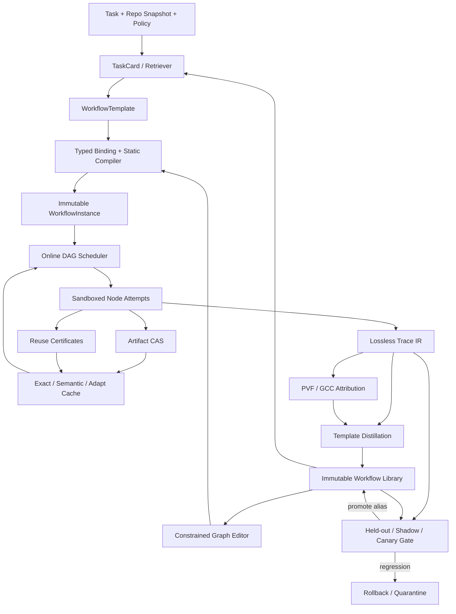

# v0.2：基于 Graph Workflow IR 的可观测、可复用、受控进化 Coding Agent

> 日期：2026-07-13  
> 状态：并行调研后的收敛设计；待原型与实证验证  
> 原始版本：`SELF_EVOLVING_AGENT_RESEARCH_PLAN.md` v0.1  
> 详细报告：`research/reports/`

---

## 0. 本轮把什么问题解决到了什么程度

| 方向 | 已完成的设计决策 | 尚未完成 |
|---|---|---|
| 问题定义 / credit | 将 single-trace 方法降格为 removal-risk proxy；设计 PVF + GCC；给出 96 个 node-task pair 的 LOO 校准方案 | 真实 trace 上的相关性、校准与跨 repo 泛化 |
| Trace / Graph 数据模型 | 分离 Graph IR、Trace IR、Artifact CAS、Reuse Certificate；定义版本与依赖观测 | 完整 JSON Schema、实际 runtime instrumentation、read-set 捕获覆盖率 |
| 去重 / 缓存 | exact/semantic/adapt 三档；exact 依赖闭包；semantic 必须 contract + verifier；unknown fail closed | semantic hard-negative benchmark、验证器强度、命中收益 |
| 动态调度 | 增量数据流图、`SEAL_NODE`、事件驱动 readiness、多资源 admission、幂等提交 | 真实 API 负载与动态 branch speculation 实证 |
| 聚合 / 反馈 / 广播 | deterministic-first fan-in、结构化 code merge、双层停机、pull-first critical-push | 多语言语义 merge、verifier 误报、在线路由学习 |
| Workflow IR | 选择 graph-centered 三层混合 IR，只有 typed graph 是权威源；code/prompt/tool 是内容寻址 artifact | DSL escape-hatch 比例、schema 可表达性与迁移成本 |
| 蒸馏 | frequent + utility + episode 三路挖掘；typed anti-unification；locked holdout | 真实数据上的 support、效用与模板稳定性 |
| 检索 / graph editing | TaskCard/TemplateCard 混合检索、硬过滤、风险 rerank、小半径安全宏编辑、champion fallback | 训练数据、surrogate accuracy、编辑实际增益 |
| 自进化稳定性 | 原则上采用 immutable archive + champion-challenger + paired held-out gate + rollback | 具体统计门槛与 drift 机制待专门报告和实证 |
| Novelty | 已证伪原来的宽泛表述，并收窄成可检验系统主张 | 仍需持续追踪 2026 后续工作 |

**结论：**算法问题没有被“理论上彻底解决”，但已经从模糊开放问题收敛为可实现算法、接口、实验和 kill criteria。下一步不应继续泛调研，而应实现 v0 Trace/Exact-Reuse 原型并采集数据。

---

## 1. 重新定义项目主张

### 1.1 不再主张什么

截至 2026-07-13，以下宽泛主张已经不成立：

- coding workflow 自进化无人做；
- agent graph 可优化无人做；
- query-conditioned workflow 生成无人做；
- coding trace 蒸馏成 skills 无人做；
- self-modifying coding agent 无人做。

EvoMAC、SEW、DGM、Socratic-SWE、GPTSwarm、MaAS、FlowReasoner、MermaidFlow 等已覆盖上述大块能力。证据与边界见 `research/worklogs/evidence-ledger.md`。

### 1.2 收窄后的核心主张

> 在 repository-level coding agent 场景中，构建一个统一系统，显式记录 repo/effect-aware execution graph，以 dependency-sound content addressing 复用可证明安全的子任务结果，用经少量真实 removal 校准的 single-trace proxy 估计删除风险，将成功 trace 蒸馏成 typed executable Workflow IR，并通过 retrieve-and-constrained-edit 与 champion gate 受控更新；端到端测量 pass rate、token、wall-clock、critical path、cache precision 和 regression risk。

### 1.3 三个独立可证伪的研究主张

#### Claim A — 可观测

Trace IR 是否能完整记录：

- logical node / attempt；
- data/control/spawn/join/feedback 边；
- artifact use/derive/validate/overwrite；
- repo snapshot 与 read/write/negative dependencies；
- effect、权限、model/tool/prompt/runtime 版本；
- token、费用、wall-clock、critical path；
- cache/retry/cancel/merge decisions。

#### Claim B — 安全 exact reuse

在不降低 patch correctness 的前提下，dependency-sound exact memoization 是否能减少重复 repo exploration、tool execution 与 LLM token？

#### Claim C — 经校准的受控改进

single-trace removal-risk proxy 是否能高精度筛出安全可跳过/合并节点，并在 immutable archive + held-out gate 下提高综合效用？

---

## 2. 收敛后的系统架构



### 2.1 唯一真相源原则

| 对象 | 权威性 | 说明 |
|---|---|---|
| `WorkflowTemplate` | 库中的权威模板 | 参数化 typed graph；声明 ports、effects、budgets、permissions、loops |
| `WorkflowInstance` | 本次运行的权威计划 | slots 全绑定、artifact 全解析、不可变、可 hash |
| `Execution Trace` | 实际发生过什么的权威事实 | attempts、events、outputs、dependencies、costs、failures |
| code/tool/model/prompt | 内容寻址执行 artifact | 被节点引用，不与 graph 成为平权控制源 |
| NL summary / embeddings / graph signature | 派生视图 | 只用于检索、解释与挖掘 |

---

## 3. WS0 + WS5：归因问题的收敛方案

详细设计：`research/reports/01_CREDIT_ASSIGNMENT_AND_METRICS.md`

### 3.1 Estimand 与 estimator 分离

真实 LOO 贡献：

\[
\Delta_i^Q = \mathbb E_\xi[Q(\tau_{full,\xi}) - Q(\tau_{-i,\xi})]
\]

单次 trace 只能估计：

\[
\widehat{\Delta}_i,\qquad
p_i^{harm}=P(\Delta_i^Q>\epsilon_Q\mid \tau)
\]

因此项目术语改为：

- `causal marginal contribution`：由真实 intervention 定义；
- `trace attribution proxy`：一次 trace 的观测估计；
- `removal-risk estimator`：预测删除节点是否会伤害质量；
- `structural redundancy`：跨运行、按 task stratum 条件化的低风险冗余。

### 3.2 算法 A：PVF

**Provenance-and-Verification Flow**：

1. 把输出拆成 artifact atoms；
2. 记录 read/quote/derive/validate/overwrite/side-effect 关系；
3. 从最终保留 artifact、测试、verifier 成功/失败建立正负 anchor；
4. 在 occurrence DAG 上反向传播 credit；
5. 计算 node credit、dead cost、credit density、critical-path waste。

它是冷启动、可解释、线性复杂度的 proxy，不恢复不可观察的隐式启发与高阶协同。

### 3.3 算法 B：GCC

**Graph Counterfactual Critic**：用少量真实 removal 数据学习：

\[
P(\text{removal harms quality}\mid \text{single trace features})
\]

第一版优先 logistic/GBDT，数据足够后再用 GNN。输出必须校准不确定性，OOD 时拒绝自动剪枝。

### 3.4 LOO 校准设计

首轮约 96 个 node-task pair：

- 40：预测低贡献但高成本；
- 24：PVF/GCC 分歧或阈值附近；
- 12：高贡献正对照；
- 12：随机样本；
- 8：人工空节点/重复节点。

必须分开：

- structural ablation；
- cheaper-model replacement；
- edge/message ablation；
- multi-node coalition audit。

### 3.5 自动剪枝安全层级

```text
Dashboard only
→ Shadow ranking
→ Lazy skip + on-demand fallback
→ Canary skip
→ Conditional gate
→ Template hard prune
```

禁止：

- 一次零分后永久删；
- 仅凭 attention 或 LLM 自报；
- 自动删 final verifier、安全节点、orchestrator、不可逆副作用节点；
- 把失败任务中的零 credit 直接解释为无价值。

---

## 4. WS1 + WS2：Trace、Content Addressing 与安全复用

详细设计：`research/reports/02_TRACE_AND_SAFE_REUSE.md`

### 4.1 核心实体

```text
Graph IR            逻辑 workflow
Execution Trace IR  一次执行与 attempts
Artifact CAS        不可变输出 bytes
Dependency Manifest 实际依赖闭包
Reuse Certificate   可复用声明与验证证据
Cache Entry          索引与生命周期
```

### 4.2 Cache key 不再是一个 hash

| Key | 用途 |
|---|---|
| `artifact_id` | 输出内容身份 |
| `operation_key` | task contract + implementation + output contract |
| `context_key` | runtime/tool/model/prompt/environment/security/policy |
| `flight_key` | 同时进行的执行能否 singleflight |
| `realization_key` | 实际 dependency manifest 完全一致 |
| `semantic_retrieval_key` | 只找候选，不授权复用 |
| `adaptation_key` | source certificate 到 target contract 的适配执行身份 |

### 4.3 Repo snapshot

不能只记录 Git HEAD，必须覆盖：

- base commit；
- index；
- dirty tracked files；
- visible untracked/generated files；
- symlink/mode；
- environment/toolchain；
- network/time/random；
- absence/glob/search/directory membership 等负依赖。

推荐每个节点读取不可变 snapshot，写入产生 patch 或新 snapshot。

### 4.4 三档复用

#### EXACT

满足 task、contract、runtime、权限、完整 dependency manifest、freshness 与 effect 条件后直接 materialize。

#### SEMANTIC

只允许旧 artifact 的结构化 claims/coverage **非对称地直接满足**新 contract，且依赖有效、可机器验证、风险桶达标。

#### ADAPT

旧 artifact 作为输入执行新的 adapter，重新验证并签发新 certificate；它是新节点和新成本，不计作 direct cache hit。

### 4.5 安全闸门

顺序不可绕过：

```text
schema → integrity → trust → authority → contract
→ dependency → freshness → environment → effect
→ noninterference → verifier → risk
```

任何 hash/security-critical 字段未知或依赖捕获不完整：`fail closed`。

### 4.6 MVP 只开启

- same tenant/project；
- immutable snapshot；
- PURE/READ_ONLY；
- deterministic tools；
- complete read-set；
- no live network/time/random；
- structured artifacts；
- exact dependency validation；
- in-flight singleflight。

---

## 5. WS3：动态 DAG 调度

详细设计：`research/reports/03_DYNAMIC_DAG_SCHEDULER.md`

### 5.1 关键决策

- 不等待完整 DAG；使用增量图和事件驱动 readiness；
- 每个节点执行前必须 `SEAL_NODE`；封口后禁止新增入边；
- replan 创建新 epoch/version，不原地改变已封口节点；
- logical readiness 与 resource admission 分离；
- dependency completion 沿 adjacency 传播，整体近似 \(O(V+E)\)；
- 通用 exactly-once 不承诺，采用 at-least-once + commit-once + idempotency keys。

### 5.2 Readiness

边支持：

- `DATA_SUCCESS`
- `CONTROL_SUCCESS`
- `CONTROL_DONE`
- `GUARD_TRUE`
- `OPTIONAL_DATA`
- `SOFT_HINT`

节点 trigger 支持：

- `ALL_SUCCESS`
- `ALL_DONE`
- `ANY_SUCCESS`
- `QUORUM(k)`
- `CUSTOM(predicate)`

### 5.3 资源调度

每个 provider/tool 的 capacity：

- requests/RPM；
- tokens/TPM；
- concurrent slots；
- token/$ budget；
- CPU/GPU/tool-specific slots。

Dispatch 前 reservation，结束后按 actual usage reconciliation。

### 5.4 优先级

结合：

- deadline slack；
- online bottom-level p95；
- critical-path estimate；
- information gain；
- aging/fairness；
- expected cost。

### 5.5 Speculation

仅当：

\[
EV_j=p_jB_j-(1-p_j)W_j-O_j-R_j>0
\]

并且节点 pure/read-only/sandboxed、概率已校准、不挤占关键节点、可快速取消时启用。高负载或接近 quota 时自动归零。

---

## 6. WS4：Fan-in、反馈环与横向广播

详细设计：`research/reports/04_FANIN_LOOPS_BROADCAST.md`

### 6.1 reducer 与 aggregator 分离

- reducer：并发状态确定性合并，要求结合/交换/幂等；
- aggregator：判断正确性、选择或综合，不由 runtime primitive 保证。

### 6.2 聚合优先级

```text
外部 verifier
> 确定性结构合并
> 来源独立的共识
> 校准排序
> 生成式 synthesis
> abstain/escalate
```

### 6.3 Code merge

Patch 不能是裸 diff，需携带：

- base commit/tree；
- intent；
- changed files/symbols；
- requires/provides/removes；
- invariants；
- evidence/provenance。

Pipeline：

```text
freeze base
→ normalize/rebase
→ dedup
→ atomize changes
→ conflict graph
→ deterministic/typed merge
→ combined-tree tests and invariants
→ compare-and-swap promotion
```

`UNKNOWN` 或 semantic conflict 一律转 adapter patch / human / abstain。

### 6.4 Feedback loop

双层停机：

- 业务层：acceptance contract、defect mass、test progress、regression、plateau、cycle；
- runtime 层：round/token/time/tool/cost hard budget。

保存 best checkpoint；冻结第 0 轮 acceptance contract；新需求进入 backlog，防止 verifier goalpost drift。

### 6.5 Broadcast

默认：`pull-first, critical-push`。

- 普通发现进黑板；
- API/schema change、安全警报、阻塞错误定向 push；
- 正文保存一次，只广播引用；
- ACL/version/causal loop/exact dedup 为硬门；
- relevance × novelty × evidence × freshness × urgency / cost 做 top-k；
- TTL、source-family cap、digest、backpressure、retraction 防消息风暴。

---

## 7. WS6：Workflow IR 与蒸馏

详细设计：`research/reports/05_WORKFLOW_IR_AND_DISTILLATION.md`

### 7.1 选型

采用 **graph-centered 三层混合 IR，但只有一个权威源**：

```text
NL/embedding retrieval view  ← 派生
WorkflowTemplate typed graph ← 库中权威
WorkflowInstance             ← 本次运行权威
runtime code/tool/model/prompt artifacts
execution trace graph
```

### 7.2 Template 必须声明

- typed input/output ports；
- operation/artifact refs；
- effects/permissions；
- retry/timeout/cache/idempotency；
- guards/joins/bounded loops；
- slots 与 binding time；
- budgets；
- static constraints；
- provenance/evaluation gates。

### 7.3 两个 digest

- `spec_digest`：完整执行身份，可用于 replay/cache；
- `shape_digest`：alpha-renamed、slot-abstracted 的检索/挖掘身份，**禁止**用于执行缓存。

### 7.4 蒸馏

三路发现：

1. frequent directed typed subgraphs；
2. high-value/discriminative anchor expansion；
3. partial-order episodes。

之后：

```text
canonical merge
→ exact recount by independent task cluster
→ typed anti-unification
→ interface/effect closure
→ matched utility estimation
→ tuning validation
→ locked holdout
→ shadow
```

频繁不等于有价值；成功相关不等于因果；retry 不能重复计 support。

### 7.5 版本与生命周期

独立版本轴：schema/template/runtime/artifact digest。

```text
raw motif → candidate → offline-validated → shadow
→ challenger → champion → deprecated/retired/quarantined
```

发布不可变；`latest/champion` 仅为可移动 alias；rollback 移动 alias，不篡改历史。

---

## 8. WS7：检索、实例化与小半径 Graph Editing

详细设计：`research/reports/06_RETRIEVAL_AND_GRAPH_EDITING.md`

### 8.1 TaskCard / TemplateCard

TaskCard 包含：

- goal、acceptance、task family；
- repo language/framework/build/test；
- candidate files/symbols/change surface；
- required capabilities；
- available oracle；
- tools/models/network/write/secret/budget/risk constraints。

TemplateCard 包含：

- purpose、supported families、failure signatures；
- graph signature、ports/slots/preconditions；
- tool/model/permission/budget requirements；
- success/cost/latency posterior；
- allowed edits、immutable regions、champion/version/provenance。

### 8.2 检索

候选并集：

```text
BM25
∪ dense dual-tower
∪ exact metadata
∪ graph-signature similarity
```

之后先做 hard compatibility filter，再做 risk-adjusted rerank。

### 8.3 Hard constraints

不可由 learned model 覆盖：

- tool/model availability；
- environment/version；
- typed ports/slots；
- budget lower bound；
- loop bounds；
- permissions/data flow；
- effect ordering；
- evaluator isolation；
- mandatory verifier/human gate。

### 8.4 MVP graph editing

不允许自由生成任意图；只允许深度 ≤2 的安全宏：

- `INSERT_VERIFIER/TESTER/REVIEWER`
- `PARALLELIZE`
- `ADD_AGGREGATOR`
- `ADD_BOUNDED_RETRY`
- `PRUNE_BRANCH`
- `SHARE_OR_MEMOIZE(pure_subgraph)`
- `SWITCH_MODEL/TOOL`
- `ADJUST_BUDGET`
- `WRAP_SANDBOX`
- `ADD_GUARD`

流程：

```text
retrieve top 20
→ rank top 5
→ instantiate
→ enumerate edits depth ≤2
→ static validate
→ surrogate score + uncertainty
→ execute at most top 1–2
→ fallback champion
```

### 8.5 Cold start

人工提供：

- T0 Direct：Inspect → Implement → Test；
- T1 Safe Generic：Inspect → Plan → Implement → Test → BoundedFix → Review；
- T2 Bugfix：Reproduce → Localize → Patch → RegressionTest → Review；
- T3 Complex：ParallelExplore → AggregatePlan → Implement → Test → Review。

先规则路由，再 BM25/metadata，再 learned reranker，最后才 editor policy。

---

## 9. WS8：Champion-Gated Self-Evolution

详细设计：`research/reports/07_SELF_EVOLUTION_STABILITY.md`

### 9.1 能保证与不能保证

只能保证：

- candidate 隔离；
- 不可变 archive 与血缘；
- paired held-out 统计门禁；
- 探索暴露与累计损失有预算；
- shadow/canary 可停止；
- champion 可回滚、后代可 quarantine。

不能保证开放世界中的逐轮单调改进。`archive best-so-far`、`current candidate`、`production champion` 必须分别报告，不能用历史最优掩盖当前版本退化。

### 9.2 Archive 与 Champion

- release 不可变，记录 parent/diff/evidence/runtime/model/schema/policy；
- champion 按 task stratum 维护，不强迫一个模板统治所有任务；
- archive 同时保留高效、稳健、低成本和 OOD fallback 候选，防止灾难性遗忘与单一局部最优；
- evaluator、隐藏 tests、权限策略、promotion gate 不属于 evolution 可修改边界。

### 9.3 Promotion gate

数据在挖掘前冻结为：

```text
discovery → calibration → promotion/blind gate → final test
```

Challenger 晋级必须同时通过：

1. paired quality non-inferiority；
2. token/cost/latency 至少一项有置信下界改善；
3. 主要 task family/sentinel forgetting matrix 无明显退化；
4. hard safety incident = 0；
5. OOD/fallback/timeout/rollback 未异常上升；
6. 多候选比较做 winner's-curse/multiple-testing 校正。

统计单位是 task/repo cluster，不是节点。样本不足时继续 shadow/canary，不以“当前零事故”宣称绝对安全。

### 9.4 发布流程

```text
Candidate admission
→ offline replay/search
→ blind held-out gate
→ shadow
→ low-risk canary
→ staged canary
→ promote alias
→ continuous drift monitoring
→ rollback/quarantine on breach
```

### 9.5 Drift 与探索

监控：输入分布、结果质量、行为/结构、依赖/model/tool/runtime 四类 drift；定期运行 sentinel task-family matrix。探索只在独立 challenger budget 内进行，高风险任务默认不探索；累计 regret/loss 超预算时暂停整个自动闭环。

### 9.6 Kill criteria

立即终止 challenger：critical safety violation、越权副作用、hidden evaluator 泄漏、paired quality 下界越界、fallback/rollback 激增、无法重放。

暂停整个闭环：连续多个 challenger 未通过、drift 使历史证据失效、archive/evaluator 被污染、统计门禁无法重现、探索累计损失超预算。

---

## 10. 统一指标

### 10.1 Correctness

- resolved/pass rate；
- test fraction；
- new regressions；
- semantic merge regression；
- safety incidents；
- authority violations；
- stale/false cache hit。

### 10.2 Efficiency

- input/output/cached tokens；
- dollars；
- wall-clock p50/p95/p99；
- critical-path latency/stretch；
- tool/LLM calls；
- per-success cost；
- scheduler overhead。

### 10.3 Graph / reuse

- exact/semantic/adapt hit rate；
- direct-hit error rate；
- singleflight collapse；
- dead cost rate；
- low-risk removable cost；
- duplicate/stale broadcast ratio；
- critical message recall；
- invalidation fanout。

### 10.4 Attribution

- LOO AUPRC/AUROC；
- Spearman/Kendall；
- Brier/ECE；
- deletion curve/AUC；
- cost captured at fixed harm budget；
- harmful-prune/fallback/rollback rate。

### 10.5 Retrieval / evolution

- feasible/near-optimal Recall@K；
- nDCG；
- oracle regret；
- slot binding/compile/graph-validity；
- edit `P(ΔU>0)`；
- fallback rate；
- champion promotion/regression/drift rate。

---

## 11. 公平实验设计

### 11.1 Baselines

1. single-agent conservative baseline；
2. tree multi-agent baseline；
3. trace-only；
4. exact reuse only；
5. scheduler only；
6. fan-in/loop only；
7. retrieval + slot fill；
8. retrieval + rule edits；
9. attribution proxy pruning；
10. oracle/LOO subset；
11. full closed loop。

### 11.2 控制变量

- 相同模型/provider/version；
- 相同工具权限；
- 相同 token/$/time budget；
- 相同 evaluator；
- paired tasks/seeds；
- repo-group + chronological split；
- test library 只能由 train traces 构建；
- per-query editor 只能看开发 verifier，不能看最终 hidden evaluator。

### 11.3 统计

- task/repo 为 bootstrap cluster，不能按 node 当独立样本；
- pass rate 用 paired bootstrap/McNemar/permutation；
- continuous cost/latency 报 paired CI；
- promotion 使用 quality non-inferiority + cost superiority；
- 长期 canary 使用 anytime-valid confidence sequence；
- 报 Pareto frontier，不用单一任意权重掩盖 trade-off。

---

## 12. 实施 Roadmap 与 Kill Criteria

### M0：Trace-first

**实现：**

- Trace IR / WorkflowTemplate schema；
- 首个 instrumentation target 采用 OpenHands Software Agent SDK；SWE-agent/Aider 作为线性和 git-centric baseline；LangGraph 作为第二个 graph adapter；
  **【2026-07-13 修订】**首个 target 改为 **pi**（earendil-works/pi-mono，SDK 进程内 + 扩展事件采集），OpenHands/SWE-agent/LangGraph 降级为后续 adapter 候选；理由与实施见 `PI_INTEGRATION_PLAN.md`（决策 D6）。
- OTel-compatible exporter；
- repo snapshot、artifact/use/derive/effect；
- trace viewer/metrics；
- 自采 50–200 条任务。

**验收：**

- ≥95% 节点有 parent/dependency/cost；
- ≥90% 可见文件读写归因到节点；
- untracked mutation = 0；
- provenance coverage ≥70%。

**Kill/转向：**无法捕获依赖时，限制到一个 runtime，不追求跨框架通用 instrumentation。

### M1：Conservative Exact Reuse + Scheduler

**实现：**

- immutable snapshot；
- pure/read-only exact cache；
- singleflight；
- dependency validation/invalidation；
- `SEAL_NODE` event scheduler；
- resource admission/idempotency/cancellation。

**验收：**

- false exact reuse = 0；
- duplicate committed effects = 0；
- unmet dependency execution = 0；
- median token/tool-time saving ≥10%，或 p95 latency ≥10% 改善。

**Kill/转向：**exact duplicate token share <5% 时，不把去重作为主贡献。

### M2：Attribution Calibration

**实现：** PVF、LOO 96 pairs、GBDT risk model、shadow dashboard、lazy fallback。

**验收起点：**

- critical-node AUPRC ≥0.75；
- ECE ≤0.08；
- lazy-skip quality non-inferior；
- token saving CI 下界 ≥10%。

**Kill/转向：**安全删除 precision <0.8 或跨 repo 失效时，只保留诊断，不自动剪枝。

### M3：Workflow Library + Retrieval

**实现：**人工 5–10 模板、typed binding、catalog/CAS、TaskCard/TemplateCard、hybrid retrieval。

**验收：**

- slot binding ≥98%；
- type/effect validation = 100%；
- hard constraint false accept = 0；
- retrieval+slot fill 优于 T1 cold planner。

**Kill/转向：**图检索无增益时退回 NL embedding + metadata filter。

### M4：Distillation + Constrained Editing

**实现：**三路 motif mining、anti-unification、safe macro beam search、sandbox/champion fallback。

**验收：**

- valid edit rate 高；
- paired `P(ΔU>0)` 和净效用显著；
- 无新增 hard safety violation；
- OOD 任务可可靠回退。

**Kill/转向：**opaque code escape hatch >20% 或 learned edits 不优于 rule edits，则保留 code-authoritative fallback / rule editor。

### M5：Champion-gated Evolution

**实现：**archive、paired held-out、shadow/canary、alias promotion、drift、rollback/quarantine。

**验收：**

- champion quality non-inferior；
- cost/latency 至少一项 CI 下界改善；
- task-family holdout 无明显退化；
- critical incident = 0；
- 100% 可回滚与可追溯。

---

## 13. 调研后仍然真正开放的问题

1. shell/compiler/LSP/Git/network 的完整 read-set 捕获能否以可接受开销实现？
2. `TaskContract` 如何表达自由文本 claims、coverage、scope subsumption 与 verifier postconditions？
3. provider 不暴露 immutable model revision 时，LLM 输出能否进入 exact result cache？
4. semantic reuse 的 hard-negative benchmark 如何构造？
5. 真实 coding trace 上 PVF 与 removal 的相关性是多少？
6. pairwise/coalition interaction 在多大程度上破坏单节点 LOO？
7. 动态 branch speculation 是否在 agent workflow 中有稳定净收益？
8. 多语言 patch 的 semantic conflict detection 能做到多强？
9. verifier 不可靠或可被 reward-hack 时，promotion gate 如何保持可信？
10. typed Graph IR 的 code-native escape hatch 比例会不会过高？
11. frequent/high-value subgraph 是否能跨 repo/task family 泛化？
12. learned ranker/editor 的不确定性是否足以支持 OOD 回退？
13. 如何处理 cache/trace 的 tenant privacy、存在性侧信道与撤销？
14. 自进化在 model/runtime/schema 版本变化时如何重校准历史证据？
15. 端到端收益是否足以覆盖 tracing、validation、retrieval、editing 与 promotion 的额外成本？

这些问题不能靠继续写设计文档解决，必须由 M0–M5 实验回答。

---

## 14. 最小论文/产品切片建议

若目标是尽快得到可发表/可用结果，建议先做：

### Paper A：Trace + Exact Reuse

- repository-aware execution graph trace；
- dependency-complete exact memoization；
- dynamic scheduler；
- SWE-bench/真实 repo token、latency、correctness。

### Paper B：Calibrated Trace Attribution

- PVF；
- sparse LOO calibration；
- conditional structural redundancy；
- lazy skip/fallback；
- deletion-risk benchmark。

### Paper C：Typed Workflow Memory

- graph-centered Workflow IR；
- trace-to-template distillation；
- hybrid retrieval；
- constrained edit；
- champion gate。

不要把 A+B+C 全部压进第一个 MVP。

---

## 15. 详细产出索引

- `research/reports/00_PLAN_AUDIT_AND_REFRAME.md`
- `research/reports/01_CREDIT_ASSIGNMENT_AND_METRICS.md`
- `research/reports/02_TRACE_AND_SAFE_REUSE.md`
- `research/reports/03_DYNAMIC_DAG_SCHEDULER.md`
- `research/reports/04_FANIN_LOOPS_BROADCAST.md`
- `research/reports/05_WORKFLOW_IR_AND_DISTILLATION.md`
- `research/reports/06_RETRIEVAL_AND_GRAPH_EDITING.md`
- `research/reports/07_SELF_EVOLUTION_STABILITY.md`
- `research/reports/08_FRAMEWORK_AND_BENCHMARK_SURVEY.md`
- `research/OPEN_ISSUES.yaml`
- `research/worklogs/`

---

## 16. 总架构红队后新增的 P0 统一约束

以下约束覆盖前文任何不一致表述：

1. **统一身份：**唯一 canonical 对象为 `WorkflowTemplateRelease` 与绑定后的 `WorkflowInstance`；`GraphIR` 只是编译视图。所有 trace/cache/run 以 `template_release_digest + instance_digest` 为外键。
2. **正交 Effect Schema：**不再让 `PURE/READ_ONLY/IDEMPOTENT/...` 单枚举承载全部语义，拆成 `reads`、`writes`、`external_effect`、`replayability`、`idempotency`、`compensation`、`authority`。
3. **动态图事件化：**不可变 instance 的运行时扩展通过 `GraphDeltaEvent` 记录；节点身份为 `(instance_digest, epoch, logical_node_id, expansion_index)`；sealed epoch 不可修改。
4. **归因接口闭合：**Trace IR 必须加入 `ArtifactAtom`、`ArtifactUseEvent`、`DerivationEvent`、`ValidationEvent` 与 final-retention anchor；若 instrumentation 只能做到 artifact/node 级，论文主张同步降级。
5. **Exact 的适用范围：**只把 hermetic、deterministic、完整依赖可强制捕获的 operator 称为 dependency-sound EXACT；LLM 与开放环境节点默认 MISS 或 `verified result reuse`，不承诺 exact equivalence。
6. **共享契约先于高级功能：**先实现共同的 `TaskContract`、`AcceptanceContract`、`ArtifactRecord`、`PatchEnvelope`、`VerificationReport`；在此之前禁用 semantic direct hit、自动 semantic merge 和自动 champion promotion。
7. **控制面防污染：**命令使用 `CommandSpec(argv,cwd,env,capability)`，禁止 tainted issue/repo/web 文本直接决定 shell、tool、权限、网络目标或写范围。
8. **单一 PromotionTransaction：**锁定 base snapshot 与 attempt generation，生成 candidate tree，完成验证，CAS 更新目标 ref，最后原子发布 Artifact/Certificate/Cache；旧 attempt 或任一步失败不得发布。
9. **四级数据注册表：**在挖掘前冻结 discovery/calibration/promotion/final-test，按 repo+时间分组；“0 错误”只作为工程不变量，统计结论改报风险上置信界。
10. **不主张组件首创：**最终 novelty 只落在统一 contracts、依赖闸门、校准归因、typed constrained evolution 与公开端到端 benchmark 的组合和消融。
