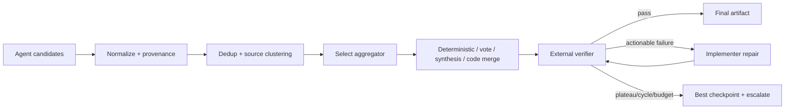

# WS4 并行攻关收敛报告

> **核验日期：2026-07-13**  
> **范围：**fan-in 聚合、code/diff merge、verifier↔implementer 环终止、横向广播与信息过载。  
> **说明：**已完成 5 路并行研究与交叉审查；**未修改原研究计划文件**。

## 一、结论先行

1. **必须区分“传输 reducer”和“语义 aggregator”。**  
   reducer 解决并发状态如何确定性汇合；aggregator 解决哪个结果正确、如何综合。LangGraph 的 reducer、fan-in 和循环原语只解决运行时编排，不提供语义正确性或收敛保证。citeturn184277search3turn672416search0turn805425search1

2. **默认聚合流水线应是：**
   ```text
   类型化收集 → 来源去重/分组 → 外部验证
   → diversity-aware top-k → 有界 synthesis/merge
   → 最终验证 → 接受或 abstain
   ```

3. **代码 fan-in 必须 deterministic-first：**冻结 base、三方试合并、冲突图、注册式 AST/CST reducer、组合树测试、CAS promotion；不能让 LLM 直接选择 `ours/theirs`。

4. **反馈环采用“双层终止”：**
   - 业务层：测试、缺陷集合、进展、振荡等条件；
   - 运行时层：轮次、token、时间、工具调用和 LangGraph `recursion_limit` 硬熔断。  
   `recursion_limit` 只能作为失控保护，不能代替正常停机策略。citeturn184277search3turn672416search1

5. **广播采用 pull-first、critical-push：**普通发现进入黑板供订阅者拉取；只有接口变化、阻塞错误、安全警报等高优先级事件才定向推送。禁止默认 all-to-all 复制完整推理轨迹。

6. **安全原则：共识不授权。**多数票、MoA synthesis 或 LLM judge 都不能覆盖编译器、测试、约束检查、权限策略等硬失败；无法验证时必须允许 `ABSTAIN/ESCALATE`。

---

# 二、已核验一手资料及其实际边界

| 资料 | 直接支持 | 不支持 |
|---|---|---|
| **Graph of Thoughts，arXiv:2308.09687 / AAAI 2024** | thought 图、生成、聚合、精炼、评分和可执行 Graph of Operations | 不证明任意反馈图收敛；没有通用停机判据；不证明代码 merge 安全。citeturn184277search0turn834466search0 |
| **Mixture-of-Agents，arXiv:2406.04692** | 多 proposer、分层 aggregator、生成式 synthesis；异质 proposer 通常优于同模型重复采样 | 不证明 agent 越多越可靠；稠密层间拼接会增加 token 和首 token 延迟。citeturn184277search1 |
| **Self-Consistency，arXiv:2203.11171 / ICLR 2023** | 对可规范化的固定答案，采样多条路径后多数聚合；少量样本已能获得主要收益 | 不适用于开放式 patch 合并；相关性错误可能形成稳定的错误多数。citeturn184277search2 |
| **LangGraph 官方文档** | conditional edge、循环、fan-out/fan-in、reducer、checkpoint、interrupt、recursion limit | reducer 不理解业务语义；recursion limit 到达只表示资源边界，不表示得到了正确结果。citeturn184277search3turn672416search0turn672416search1turn805425search0turn805425search1turn805425search2 |
| **Git 官方文档** | merge-base、`ort` 三方合并、无工作树副作用的 `merge-tree`、`rerere` 复用人工冲突解决 | 文本干净合并不等于语义正确；`rerere` 只能产生候选 resolution。citeturn905096search0turn905096search1turn905096search2 |
| **SafeMerge，arXiv:1802.06551 / PACMPL 2018** | 证明三方文本合并可能产生未报告的语义错误；可在受限场景验证 semantic conflict-freedom | 原型有语言、并发、异常、跨类分析等边界，不能作为任意仓库的完备证明器。citeturn905096search3turn553412search0 |
| **GPTSwarm / AgentPrune / DyLAN / MacNet** | 通信边可优化或剪枝；动态选择和稀疏通信可能减少成本；稠密通信存在冗余、上下文膨胀和性能饱和 | 离线学出的拓扑不能直接代替每条消息的在线安全、相关性和新鲜度检查。citeturn395702search0turn395702search1turn395702search2turn395702search3 |

另一个重要反证是：LLM 在缺少可靠外部反馈时，所谓 intrinsic self-correction 可能不改善甚至破坏原本正确的答案；因此 verifier 必须尽量连接编译器、测试、执行器、检索或约束工具，而不是仅靠模型自评。citeturn351181search0turn351181search2turn351181search3

---

# 三、聚合算子分类及选择策略

## 3.1 算子分类

| 类别 | 适用场景 | 关键约束 |
|---|---|---|
| **确定性类型化 reducer** | set/map、计数、诊断集合、证据卡、互不冲突字段 | 应满足结合律；并发无序时还应满足交换律，最好幂等 |
| **验证后选择** | 有测试、编译器、约束求解器或可执行 oracle | verifier 优先于票数；保留所有失败证据 |
| **多数/加权投票** | 唯一离散答案且可可靠规范化 | 按独立来源簇计票，不按消息副本或同模型重复采样计票 |
| **排序 / best-of-N** | 候选整体不可组合、但可比较 | judge 要盲化身份、交换顺序、检测不一致 |
| **生成式 synthesis / MoA** | 开放式方案、文档、互补分析 | 先去重和验证，再综合；必须与最强原候选比较 |
| **结构化 code merge** | patch、配置、schema、代码编辑 | 三方 merge + 冲突图 + AST/CST + 最终组合验证 |
| **级联聚合** | 预算敏感或高风险场景 | 便宜确定性检查先行；有分歧或低置信度才升级 |

LLM judge 已知存在位置、冗长和自偏好等问题。最低要求是随机化/交换候选顺序、隐藏模型身份，并把不一致结果标记为“不确定”，而不是强制选冠军。citeturn415818search0turn415818search1

## 3.2 选择策略

```python
def choose_aggregator(task):
    if task.risk == "HIGH" and not task.has_external_verifier:
        return ABSTAIN

    if task.output_has_safe_algebraic_join:
        return DETERMINISTIC_REDUCER

    if task.kind in {"code_patch", "config_patch", "schema_patch"}:
        return STRUCTURED_CODE_MERGE

    if task.has_external_verifier:
        return VERIFY_THEN_SELECT_OR_MERGE

    if task.answer_space == "CLOSED" and task.can_normalize_answer:
        return DIVERSITY_AWARE_VOTE

    if task.output_is_open_ended:
        return VERIFIED_HIERARCHICAL_SYNTHESIS

    return ESCALATE
```

### 推荐决策优先级

```text
外部可验证 > 确定性结构合并 > 来源独立的共识
> 校准排序 > 生成式综合 > 无法验证时 abstain
```

---

# 四、Code/Diff 场景的结构化 Merge

## 4.1 输入不能是裸 diff

```python
class PatchEnvelope:
    patch_id: str
    producer_id: str
    run_id: str
    base_commit: str
    base_tree: str
    intent_id: str

    changed_files: list[str]
    touched_symbols: list[str]
    requires: list[str]
    provides: list[str]
    removes: list[str]
    declared_invariants: list[str]

    diff_digest: str
    evidence_refs: list[str]
```

## 4.2 冲突图

每个原子 change set 是一个节点；以下关系形成边：

- `TEXT_OVERLAP`
- `SYMBOL_OVERLAP`
- `WRITE_WRITE`
- `WRITE_READ_DEPENDENCY`
- `API_OR_SCHEMA_CONFLICT`
- `MIGRATION_ORDER`
- `GLOBAL_RESOURCE_CONFLICT`
- `INVARIANT_CONFLICT`
- `UNKNOWN`

`UNKNOWN` 必须按阻塞冲突处理，不能自动 merge。

## 4.3 Pipeline

```python
def structured_merge(target_ref, envelopes, policy):
    snapshot = freeze_target(target_ref)

    admitted = verify_provenance_and_base(envelopes, snapshot)
    patches = normalize_to_same_base(admitted, snapshot)

    patches = deduplicate_exact_and_equivalent(patches)
    changes = atomize_into_change_sets(patches)

    graph = build_conflict_graph(changes)

    if graph.has("UNKNOWN") or graph.has("SEMANTIC_CONFLICT"):
        return NEEDS_ADAPTER_PATCH

    candidate = snapshot.tree

    for component in graph.canonical_components():
        if component.is_independent():
            candidate = git_three_way_merge(candidate, component)

        elif component.is_dependency_dag():
            candidate = apply_in_topological_order(candidate, component)

        elif component.is_compatible_overlap():
            reducer = registered_reducer(component.kind)
            if reducer is None:
                return NEEDS_ADAPTER_PATCH
            candidate = reducer.merge(candidate, component)

        else:
            return ESCALATE

    report = verify_combined_tree(candidate, policy.acceptance_contract)

    if report.has_required_fail_or_inconclusive():
        return REJECT_WITH_REPORT

    return compare_and_swap_promote(
        expected_ref=snapshot.commit,
        candidate=candidate,
        verification=report,
    )
```

## 4.4 必跑验证门

1. 无冲突 marker、非法 binary/submodule 或未声明 generated files；
2. parser、formatter、schema；
3. typecheck、compile、link、dependency resolution；
4. affected tests；
5. 最终组合树全量测试；
6. 静态分析、安全、secret、license；
7. API/schema/migration/concurrency 等跨 patch 不变量；
8. 高风险时加入属性测试、差分测试或形式化检查。

**自动 merge 只允许：**

```text
同一冻结 base
+ provenance 完整
+ 冲突关系已分类
+ 无 semantic/unknown conflict
+ 必要验证全部 PASS
+ promotion 时目标 ref 未变化
```

---

# 五、Verifier↔Implementer 环的预算、收敛与停机

## 5.1 状态与预算

```python
class LoopBudget:
    max_rounds: int
    max_tokens: int
    max_wall_ms: int
    max_tool_calls: int
    max_cost: float
    final_verification_reserve: float

class LoopState:
    round: int
    candidate_ref: str
    unresolved_issues: list["Issue"]
    test_summary: dict
    best_checkpoint: str
    seen_fingerprints: set[str]
    budget_used: dict
```

**MVP 初值，不是理论常数：**

- `max_rounds = 4`
- `plateau_patience = 2`
- `cycle_window = 4`
- 预留约 `20%` 预算给最终验证和回滚
- critical regression 最多允许一次诊断性恢复尝试

Self-Refine 的实验采用有限迭代，并观察到早期收益更大、随后边际收益下降且质量不一定单调，因此固定小上限比无界“继续优化”更合理；但具体数字仍需在本项目上校准。citeturn351181search0

## 5.2 收敛指标

不要使用“verifier 觉得更好了”作为唯一指标。至少跟踪：

```text
defect_mass =
  Σ unresolved(issue) × severity(issue) × evidence_confidence(issue)

progress =
  decrease(defect_mass)
  + new_passing_tests
  - new_regressions
  - patch_churn_penalty
```

同时记录：

- 必要测试通过/失败集合；
- 规范化 issue ID 集合；
- patch/tree hash；
- 新增 critical defect 数；
- diff 大小及 churn；
- verifier 分歧和证据等级。

## 5.3 停机规则

```python
def loop_decision(state, report, policy):
    if report.all_hard_requirements_pass():
        return SUCCESS

    update_best_checkpoint(state, report)

    if report.introduces_critical_regression():
        rollback_to_best(state)
        return ESCALATE if state.already_recovered_once else DIAGNOSTIC_RETRY

    fingerprint = hash_state(
        state.candidate_ref,
        normalize_issue_set(report.issues),
        report.test_summary,
    )

    if fingerprint in state.seen_fingerprints:
        return STOP_OSCILLATION

    if no_material_progress_for(policy.plateau_patience):
        return STOP_PLATEAU

    if report.constraints_infeasible_with_evidence():
        return STOP_INFEASIBLE

    if budget_cannot_cover_one_more_edit_and_final_verify():
        return STOP_BUDGET

    state.seen_fingerprints.add(fingerprint)
    return CONTINUE
```

### 防止 goalpost drift

- 第 0 轮冻结 `AcceptanceContract`；
- verifier 的每个 blocker 必须引用原始需求、安全策略或可复现工具证据；
- 新发现但不违反既有 contract 的改进进入 backlog，不得无限阻塞；
- implementer 不可删除、弱化或重写测试来“消除失败”；
- 最好保存隐藏/留出测试，防止针对 verifier 奖励投机。

### LangGraph 落地原则

```text
conditional END edge     = 正常停机
BudgetLedger             = 资源控制
checkpoint               = best-so-far / 回滚
interrupt                = 人工审批
recursion_limit          = 最后熔断
GraphRecursionError      = 受控失败，不是成功结果
```

---

# 六、横向广播路由与抑制

## 6.1 消息接口

```python
class ArtifactEvent:
    event_id: str             # 规范化内容 hash
    event_type: str           # fact/blocker/api_change/test_failure/...
    producer_id: str
    source_family: str

    topics: list[str]
    files: list[str]
    symbols: list[str]
    issue_ids: list[str]

    payload_ref: str          # 正文存一次，只广播引用
    evidence_refs: list[str]
    confidence: float

    base_version: str
    severity: int
    ttl: int
    causal_parents: list[str]
    supersedes: list[str]

    acl: list[str]
    token_estimate: int
```

## 6.2 推荐路由模式

| 消息 | 模式 |
|---|---|
| API/schema/interface 变化 | 定向 push 给直接依赖者 |
| critical test failure、安全问题 | 高优先级 push + ACK |
| 普通知识、调研发现、计划 | 黑板写入，由订阅者 pull |
| 同主题大量低优先级事件 | 周期 digest |
| 原始长日志和完整推理 | 只保存引用，按需拉取 |
| 大规模、不稳定网络 | 才考虑 gossip；默认不用 |

## 6.3 评分与预算

先执行不可绕过的硬门：

```text
ACL → base/version 新鲜度 → causal loop 检查
→ exact dedup → supersession/retraction
```

之后才计算：

```python
utility = (
    relevance
    * novelty
    * evidence_quality
    * freshness
    * urgency
) / (token_cost + latency_cost + 1)
```

```python
def route(event, subscribers, budget):
    if not acl_and_freshness_gate(event):
        return []

    if seen_or_superseded(event):
        return []

    if event.is_critical_dependency_event():
        targets = direct_dependents(event)
    else:
        scored = [
            (utility(event, agent), agent)
            for agent in subscribers
            if agent_has_related_work(agent, event)
        ]
        targets = top_k_under_token_budget(scored, budget)

    targets = enforce_source_family_cap(targets)
    targets = enforce_topic_rate_limit(targets)
    return attach_ttl_and_ack_requirement(event, targets)
```

## 6.4 抑制机制

- 内容 hash 去重；
- 同一 `source_family` 限权，避免克隆 agent 刷票；
- 每主题 cooldown 和速率限制；
- TTL、hop limit、`seen_event_ids` 防回声；
- 低优先级消息 coalesce/digest；
- 接收队列高水位后启用 backpressure；
- critical lane 预留固定预算，避免被普通消息饿死；
- 事实按**独立证据链**计数，不按转发次数计数；
- 支持 `supersedes` 和 `retracts`，错误消息撤回时传播撤回事件；
- 静态学习出的 GPTSwarm/AgentPrune 边权只能作为路由先验，不能绕过 ACL、版本和安全门。

---

# 七、主要失败模式与安全兜底

| 失败模式 | 兜底 |
|---|---|
| 同模型相关错误形成多数 | 按模型/提示/数据 lineage 聚类计票；外部 verifier |
| LLM judge 位置或冗长偏差 | 候选顺序交换、身份盲化、不一致即升级 |
| aggregator 把正确少数答案综合坏 | 保留 verifier-passing 原候选，与 synthesis 比较 |
| 文本干净 merge 但语义错误 | 最终组合树测试、跨 patch 不变量、语义分析 |
| 两个 agent 实现了同一修复导致重复行为 | intent 去重、symbol/行为 footprint、差分测试 |
| stale patch 基于旧 HEAD | 强制 `base_commit`，重新规范化并重新验证 |
| merge 顺序不交换 | 结果 hash/测试随顺序变化即判冲突 |
| verifier 产生错误反馈 | 要求工具证据；独立 verifier；保留 best checkpoint |
| implementer 删除测试或降低约束 | 签名测试 manifest、隐藏测试、策略 diff gate |
| A↔B 修复振荡 | 状态指纹、周期检测、回滚并上报 |
| verifier 不断添加新要求 | 冻结 acceptance contract；新需求进 backlog |
| all-to-all 消息风暴 | pull-first、top-k、TTL、digest、背压 |
| 消息回声或谣言级联 | causal DAG、seen set、证据簇、retraction |
| 陈旧信息污染 | `base_version` 和 freshness gate |
| 权限/隐私越界 | ACL/clearance 在相关性评分前执行 |
| checkpoint 恢复重复执行副作用 | 幂等 id、事务/补偿、节点重放安全 |
| fan-in 等待 straggler 死锁 | deadline、取消、partial-result policy；高风险不得静默缺席 |
| 工具或 aggregator 故障 | 返回已验证候选集合，不做未经验证的自动综合 |

## 分层降级顺序

```text
自动 merge/接受
→ 请求 adapter patch
→ 降级为 verify-then-select
→ 返回 best verified checkpoint + 未解决问题
→ 人工审批
→ ABSTAIN / fail closed
```

以下情况直接人工上报：

- security、权限、支付、迁移等高风险修改；
- `UNKNOWN` 或 semantic conflict；
- verifier 严重分歧；
- 振荡、预算耗尽；
- 只有 LLM judge 支持、无外部验证；
- 任一 critical dissent 未解决。

---

# 八、MVP 最小接口

```python
class Aggregator(Protocol):
    async def aggregate(
        self,
        candidates: list["ArtifactRecord"],
        contract: "AcceptanceContract",
        budget: "Budget",
    ) -> "AggregateResult": ...

class Verifier(Protocol):
    async def verify(
        self,
        candidate: "ArtifactRecord",
        contract: "AcceptanceContract",
    ) -> "VerificationReport": ...

class Router(Protocol):
    async def route(
        self,
        event: ArtifactEvent,
        subscribers: list["Subscriber"],
        budget: "RouteBudget",
    ) -> "RoutePlan": ...

class AggregateResult:
    status: Literal[
        "ACCEPTED",
        "SELECTED",
        "NEEDS_REPAIR",
        "ABSTAIN",
        "ESCALATE",
    ]
    artifact_ref: str | None
    conflicts: list
    provenance: list
    verification_ref: str | None
```

### MVP 状态流



---

# 九、最小可证伪实验

## 9.1 基线

- B0：单 implementer，一次验证；
- B1：裸 concat + 单 LLM aggregator；
- B2：Self-Consistency 多数票，仅用于离散答案；
- B3：两层 MoA 式稠密聚合；
- B4：LangGraph reducer + 固定轮次；
- P：本报告的混合聚合 + 结构化 merge + hybrid stop + relevance router。

所有比较必须控制相同总 token、LLM 调用数或成本，不能用更多推理预算制造表面收益。citeturn351181search2turn351181search3

## 9.2 实验组

1. **Fan-in：**离散答案、开放式综合、带 oracle 的代码任务；
2. **Code merge：**独立 patch、兼容重叠、语义冲突、依赖冲突、stale base；
3. **反馈环：**可修复错误、不可满足约束、A↔B 振荡、verifier goalpost drift；
4. **广播：**有用发现、重复消息、critical minority、陈旧消息、恶意消息和 ACL 泄漏。

## 9.3 核心指标

- 最终任务成功率；
- 自动 merge precision / semantic regression rate；
- verifier 覆盖率和 critical miss；
- token、成本、wall-clock；
- 平均/尾部迭代轮数；
- plateau、cycle、budget stop 正确率；
- 有用消息 precision/recall；
- critical message recall；
- duplicate/stale token ratio；
- message amplification factor；
- 未授权信息泄漏率。

## 9.4 MVP 暂定通过门槛

- 任一已知 critical 自动 merge 事故：该类自动 merge 立即禁用；
- 广播接收 token 至少下降约 30%，critical message recall 不低于 99%；
- 注入的循环和重试风暴必须 100% 在硬预算内终止；
- 与固定轮次方案相比，成功率非劣且平均成本下降；
- 同输入不同并发调度不得改变结构化 merge 结果；
- 不得仅靠增加人工上报率取得“表面安全”。

---

## 最终建议

**WS4 MVP 不要一开始训练复杂路由器或图优化器。**先实现四个 P0：

1. `Artifact/PatchEnvelope + provenance`；
2. 确定性聚合器注册表和 code conflict graph；
3. `BudgetLedger + best checkpoint + cycle detector`；
4. `blackboard + targeted critical push + TTL/dedup/backpressure`。

等积累真实 trace 后，再用 GPTSwarm/AgentPrune 式边权学习作为路由先验。这样最容易验证，也最不容易把“论文中的平均性能提升”误解成“语义安全、保证收敛或无损广播”。
